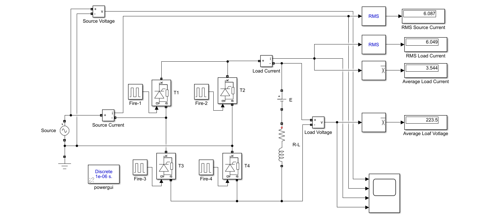
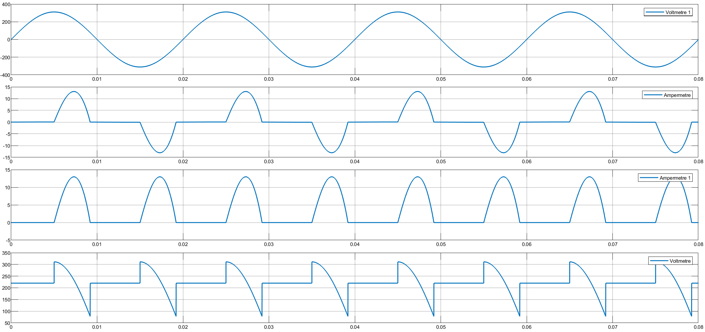

> 🇹🇷 **[Türkçe Versiyon İçin Tıklayınız / Click for Turkish Version](README_TR.md)**

---

# Single-Phase Full-Wave Controlled Rectifier with RLE Load

This project presents the simulation and mathematical analysis of a **Single-Phase Full-Wave Fully Controlled Rectifier** connected to an **RLE Load** (Resistance, Inductance, and DC Voltage Source).

## 🎓 Project Information

| Field | Details |
| :--- | :--- |
| Course | EEM312 Power Electronics |
| Institution | Sakarya University |
| Term | Spring 2016 |
| Instructor | Prof. Dr. U. Arifoğlu |

## 📄 Problem Statement

A single-phase full-wave controlled rectifier is connected to the grid and feeds an RLE load (simulating a battery charging scenario).

### System Parameters

* **Grid Voltage:** $V_{rms} = 220 \text{ V}$, $f = 50 \text{ Hz}$
* **Load:** $R = 1 \, \Omega$, $L = 10 \text{ mH}$, $E = 220 \text{ V}$
* **Firing Angle:** $\alpha = 90^\circ$
* **Snubber Circuits:** $R_s = 5000 \, \Omega$, $C_s = 250 \, \mu F$

### Objective

1.  Calculate Average Load Voltage ($V_{dc}$).
2.  Calculate Average Load Current ($I_{dc}$).
3.  Calculate RMS Load Current ($I_{rms}$).
4.  Calculate RMS Source Current ($I_{s,rms}$).
5.  Implement the circuit in Simulink.

## 🧮 Mathematical Background

The system is analyzed using the transient response of an RL circuit with a DC offset ($E$).

**1. Conduction Condition:**
The thyristors can only trigger when the source voltage is greater than the back EMF ($E$).

$$V_m \sin(\omega t) > E \implies 311 \sin(\omega t) > 220$$

With $\alpha = 90^\circ$, triggering is possible.

**2. Differential Equation:**
During conduction ($\alpha < \omega t < \beta$):

$$V_m \sin(\omega t) = R i(t) + L \frac{di}{dt} + E$$

**3. Output Voltage Behavior (Discontinuous Mode):**
Due to the high value of $E$ and $\alpha=90^\circ$, the current is discontinuous.
* **When Conducting:** $v_o(t) = |v_s(t)|$
* **When Current is Zero:** $v_o(t) = E$

## ⚙️ System Topology & Simulation Model

### Circuit Diagram & Simulink Model

The following circuit topology was implemented in Simulink using the `Power Systems` blockset.



###  Simulation Parameters

The Simulink model is configured with the following parameters:

| Field | Details |
| :--- | :--- |
| Solver | `ode23tb` |
| Stop Time | `0.08` s |
| Powergui | Discrete, $T_s = 1e-6$ s |

## 💻 Control Algorithm & Implementation

The following script solves the differential equation to find the extinction angle ($\beta$) and calculates the required values.

### MATLAB Code

```matlab
% =========================================================================
% PROJECT 04: 1-Phase Full-Wave Controlled Rectifier with RLE Load
% Analytical Solution using MATLAB Symbolic Toolbox
% =========================================================================

clear; clc;

% --- 1. SYSTEM PARAMETERS ---
V_rms_grid = 220;                % Grid Voltage (V)
Vm = V_rms_grid * sqrt(2);       % Peak Voltage (V)
f = 50;                          % Frequency (Hz)
w = 2*pi*f;                      % Angular Frequency (rad/s)
T = 1/f;                         % Period (s)

R = 1;                           % Resistance (Ohm)
L = 0.01;                        % Inductance (10 mH)
E = 220;                         % Back EMF / Battery Voltage (V)
alpha_deg = 90;                  % Firing Angle (Degrees)

% Time conversions
t_alpha = (alpha_deg / 360) * T; % Firing time (s)

fprintf('--- PROJECT 04 CALCULATION RESULTS ---\n');
fprintf('Vm: %.2f V, E: %.2f V, Alpha: %d deg\n', Vm, E, alpha_deg);

% --- 2. SOLVE DIFFERENTIAL EQUATION ---
% Equation: L(di/dt) + R*i = Vm*sin(wt) - E
% General Solution: i(t) = I_forced + I_natural
% Using dsolve to get the exact symbolic function

syms t i(t)
eqn = L*diff(i, t) + R*i == Vm*sin(w*t) - E;
cond = i(t_alpha) == 0;
i_sym(t) = dsolve(eqn, cond);

% Convert symbolic solution to a fast numeric function handle
i_func = matlabFunction(i_sym(t));

% --- 3. FIND EXTINCTION ANGLE (Beta) ROBUSTLY ---
% Instead of fzero which might return t_alpha, we step forward to find
% where current goes back to zero.

dt_step = 1e-5; % 10 microseconds step
t_search = t_alpha + dt_step;
limit_time = t_alpha + T/2; % Max conduction is 180 degrees (half cycle)

found = false;
while t_search < limit_time
    val = i_func(t_search);
    if val < 0
        found = true;
        break;
    end
    t_search = t_search + dt_step;
end

if found
    % Refine the root with fzero in the small interval where sign changed
    t_beta = fzero(@(x) i_func(x), [t_search - dt_step, t_search]);
else
    % If never goes negative, it might be continuous or limit reached
    t_beta = limit_time;
end

beta_deg = (t_beta / T) * 360;
fprintf('Extinction Angle (Beta): %.2f degrees\n', beta_deg);

% Conduction interval
t_start = t_alpha;
t_end   = t_beta;

% --- 4. CALCULATE OUTPUT VALUES (NUMERIC INTEGRATION) ---

% A) Average Load Voltage (V_dc)
% V_out = |Vs| when conducting, V_out = E when not conducting.
% Since it is Full Wave, calculate for T/2 period.

% Interval 1: Conducting (t_alpha to t_beta) -> v = Vm*sin(wt)
% Note: Use abs(sin) because full wave rectifier flips the negative cycle
v_func_cond = @(x) abs(Vm * sin(w*x));

% Integral during conduction
area_cond = integral(v_func_cond, t_start, t_end);

% Interval 2: Non-Conducting (t_beta to t_alpha + T/2) -> v = E
% The duration where current is zero within one pulse period (T/2)
t_period_end = t_alpha + T/2;
duration_off = t_period_end - t_end;
area_off = E * duration_off;

V_load_avg = (2/T) * (area_cond + area_off);
fprintf('a) Average Load Voltage (Vdc):       %.2f V\n', V_load_avg);

% B) Average Load Current (Idc)
% Integrate current function from start to end
area_current = integral(i_func, t_start, t_end);
I_load_avg = (2/T) * area_current;
fprintf('b) Average Load Current (Idc):       %.2f A\n', I_load_avg);

% C) RMS Load Current (I_rms)
% Integral of i(t)^2
area_current_sq = integral(@(x) i_func(x).^2, t_start, t_end);
I_load_rms = sqrt((2/T) * area_current_sq);
fprintf('c) RMS Load Current:                 %.2f A\n', I_load_rms);

% D) RMS Source Current (Is_rms)
% For Full Wave, Source RMS = Load RMS
fprintf('d) RMS Source Current (Grid):        %.2f A\n', I_load_rms);

```

## 📊 Results & Discussion

The simulation results confirm the theoretical analysis for the RLE load in discontinuous conduction mode.

**1. Waveform Analysis:**
The scope output below visualizes the system behavior:
* **Row 1 (Source Voltage):** Sinusoidal input.
* **Row 2 (Source Current):** AC current pulses with zero intervals, confirming discontinuous conduction.
* **Row 3 (Load Current):** Unidirectional pulses.
* **Row 4 (Load Voltage):** Shows the voltage following the source during conduction and clamping at the battery voltage level ($E=220$ V) when the current is zero.



## 📂 Project Files

* [Matlab_Calculation.m](Matlab_Calculation.m) - MATLAB script for initializing variables.
* [Simulink_Simulation.mdl](Simulink_Simulation.mdl) - The main Simulink model file.