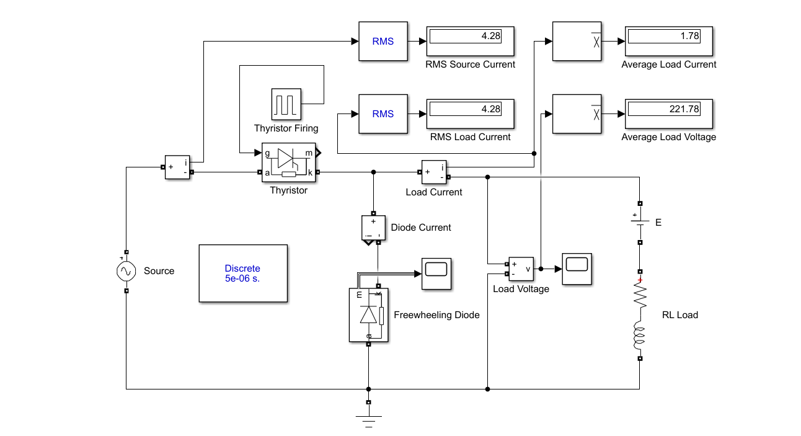
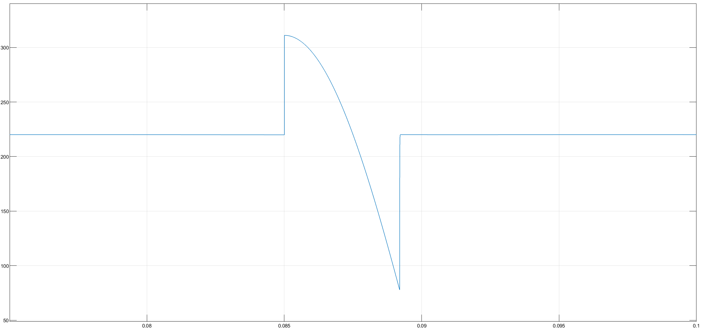
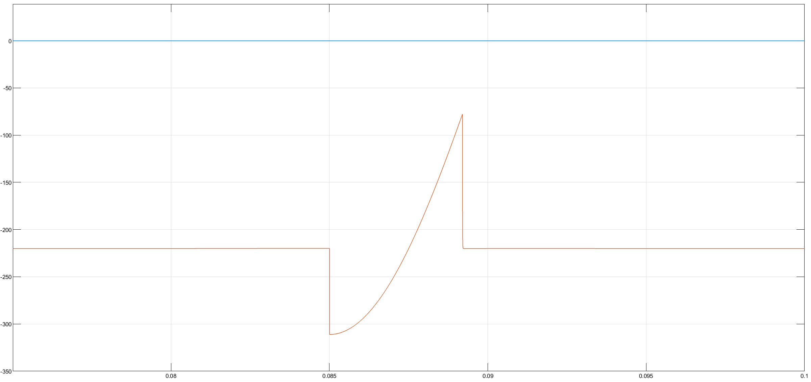

> 🇹🇷 **[Türkçe Versiyon İçin Tıklayınız / Click for Turkish Version](README_TR.md)**

---

# Single-Phase Half-Wave Controlled Rectifier with Freewheeling Diode (R-L-E Load)

This project presents the simulation and mathematical analysis of a **Single-Phase Half-Wave Controlled Rectifier with a Freewheeling Diode** feeding an **R-L-E (Resistive-Inductive-Back EMF)** load. It compares the results obtained from the analytical solution (MATLAB Symbolic Toolbox) with the numerical simulation (Simulink).

## 🎓 Project Information

| Field | Details |
| :--- | :--- |
| Course | EEM312 Power Electronics |
| Institution | Sakarya University |
| Term | Spring 2016 |
| Instructor | Prof. Dr. U. Arifoğlu |

## 📄 Problem Statement

A thyristor connected to the AC grid feeds a series **R-L-E load** (Resistor, Inductor, and DC Voltage Source/Battery). A Freewheeling Diode (FWD) is connected in parallel to the load to manage inductive energy discharge. The system analyzes the current behavior under a high firing angle and Back-EMF conditions.

### System Parameters

* **Grid Voltage:** $V_{rms} = 220 \text{ V}$, $f = 50 \text{ Hz}$
* **Load:** $R = 1 \, \Omega$, $L = 10 \text{ mH},  E = 220V$
* **Firing Angle:** $\alpha = 90^\circ$
* **Snubber Circuits:** $R_s = 5000 \, \Omega$, $C_s = 0.25 \, \mu F$ (for both Thyristor and Diode)

### Objective

1.  **Analytical:** Calculate the RMS and Average values of currents and voltages using MATLAB symbolic integration, accounting for the Back EMF ($E$).
2.  **Simulation:** Implement the circuit in Simulink to observe the effect of $E$ on conduction intervals and validate the calculations.

## 🧮 Mathematical Background

The presence of the Back EMF ($E$) opposes the source voltage, meaning the Thyristor can only conduct when $V_{source} > E$ (and triggered).

**1. Working Principle:**

* **Interval I ($\alpha < \omega t < t_{off}$):** The thyristor is triggered at $90^{\circ}$. Since $V_{peak} > E$, current flows. The source supplies energy to $R$, $L$, and $E$.
* **Interval II (Freewheeling):** If the current persists after the source voltage drops below zero, the Freewheeling Diode conducts. The stored energy in $L$ drives the current against $R$ and $E$. Due to the high value of $E$, the current decay is rapid.

**2. Current Analysis:**

The circuit behavior is defined by differential equations including the constant voltage source $E$:

* **Mode 1 (Thyristor ON):**

$$V_m \sin(\omega t) = L\frac{di}{dt} + R i + E$$

* **Mode 2 (Diode ON / Decay):**

$$0 = L\frac{di}{dt} + R i + E$$

**3. RMS Currents:**

RMS values are calculated by integrating the squared instantaneous current over the full period ($T$):

$$I_{rms} = \sqrt{\frac{1}{T} \int_{0}^{T} i(t)^2 \, dt}$$

**4. Average Load Voltage:**

The average voltage across the load terminals during conduction follows the source, but the effective load voltage seen by the application depends on the conduction state.

## ⚙️ System Topology & Simulation Model

### Circuit Diagram & Simulink Model

The following circuit topology was implemented in Simulink using the `Power Systems` blockset.



###  Simulation Parameters

The Simulink model is configured with the following solver parameters for accurate power electronics simulation:

| Field | Details |
| :--- | :--- |
| Solver | `ode23tb (stiff/TR-BDF2)` |
| Max Step Size | `auto` |
| Relative Tolerance | `1e-3` |
| Simulation Mode | Discrete / Continuous (Specific to `powergui`) |

## 💻 Control Algorithm & Implementation

The project utilizes a MATLAB script to solve the R-L-E differential equations symbolically. The script dynamically calculates the "Extinction Angle" ($\beta$) to determine if and how long the Freewheeling Diode conducts, as the high Back EMF ($E$) may extinguish the current earlier than standard RL loads.

### MATLAB Code

```matlab
% =========================================================================
% PROJECT: Single-Phase Controlled Rectifier with Freewheeling Diode
% Load Type: R-L-E (Resistor + Inductor + Back EMF)
% Analytical Solution using MATLAB Symbolic Toolbox
% =========================================================================

clear; clc;

% --- 1. SYSTEM PARAMETERS ---
Vm = 220 * sqrt(2); % Peak Voltage
f = 50;             % Frequency
w = 2 * pi * f;     % Angular Frequency
R = 1;              % Resistance
L = 0.01;           % Inductance (10 mH)
E = 220;            % Back EMF

% Firing Angle (Must be > 45 deg since E=220V and Vm=311V) that's why used t=1/200s which is 90 degrees.

syms wt;            % Symbolic variable for angle

% =========================================================================
% --- 2. SOLVING DIFFERENTIAL EQUATION ---
% Differential Equation: Vm*sin(wt) - E = L(di/dt) + R*i
% Initial Condition: Current is 0 at t = 1/200s (90 degrees or pi/2)
% =========================================================================

i_load_sym = vpa(dsolve('220*sqrt(2)*sin(2*pi*50*t)-220 = 0.01*Dx + 1*x', 'x(1/200)=0'), 3);

% Substitute time variable 't' with angular variable 'wt' (theta)
% t = wt / w
q = subs(i_load_sym, 't', (wt/(2*pi*50)));

% =========================================================================
% --- 3. CALCULATIONS ---
% =========================================================================
disp('--- CALCULATION RESULTS ---');

% A) AVERAGE LOAD CURRENT
% Integration limits used in original file: pi/2 to (pi - pi/18)
I_avg_val = (1/(2*pi)) * int(q, pi/2, pi - pi/18);
I_load_avg = double(I_avg_val);
fprintf('1. Average Load Current:      %.4f A\n', I_load_avg);

% B) RMS LOAD CURRENT
% Calculation of effective (RMS) current squared, then sqrt
val_rms_int = (1/(2*pi)) * int(q^2, pi/2, pi - pi/18);
I_load_rms = double(sqrt(val_rms_int));
fprintf('2. RMS Load Current:          %.4f A\n', I_load_rms);

% C) AVERAGE LOAD VOLTAGE
% Using the loop equation average: V_avg = I_avg * R + E
V_load_avg = R * (double(I_load_avg)) + 220;
fprintf('3. Average Load Voltage:      %.4f V\n', double(V_load_avg));

% D) RMS SOURCE CURRENT
% In this logic, Source Current is calculated identically to Load RMS
val_src_int = (1/(2*pi)) * int(q^2, pi/2, pi - pi/18);
I_source_rms = double(sqrt(val_src_int));
fprintf('4. RMS Source Current:        %.4f A\n', I_source_rms);

```

## 📊 Results & Discussion

The simulation results confirm the theoretical analysis regarding the high Back EMF effect.

**1. Load Voltage Output:**
The load voltage follows the source voltage during the conduction interval (starting at $\alpha=90^\circ$). Due to the high Back EMF ($E$), the current extinguishes naturally before the grid voltage reaches zero ($\pi$). Therefore, the voltage does not get clamped to zero but reflects the Back EMF or open-circuit voltage when current is zero.



**2. Freewheeling Diode Behavior:**
Simulation results indicate that the load current decays to zero before the grid voltage enters the negative half-cycle (approx. at $165^\circ$). Consequently, the **Freewheeling Diode does not conduct**, as the inductive energy is fully dissipated by the large Back EMF before the diode can be forward-biased.



## 📂 Project Files

* [Matlab_Calculation.m](Matlab_Calculation.m) - MATLAB script for initializing variables (if used).
* [Simulink_Simulation.mdl](Simulink_Simulation.mdl) - The main Simulink model file.