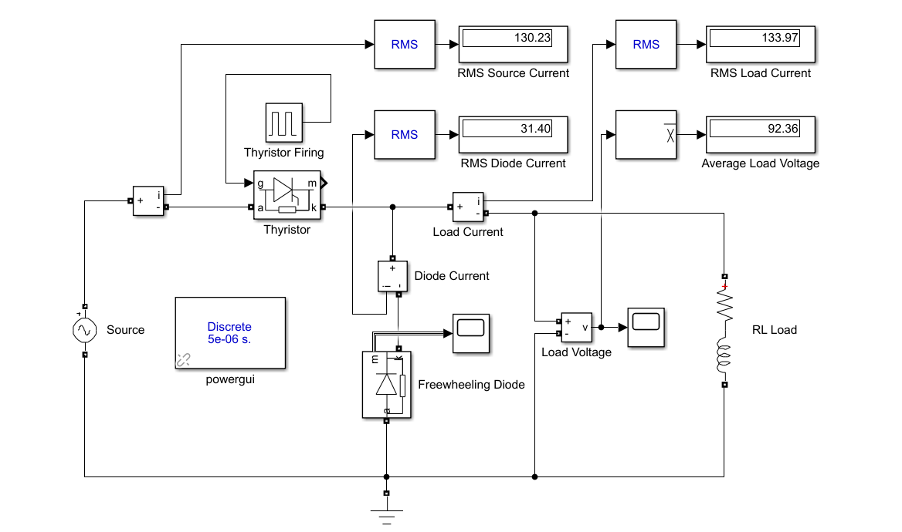
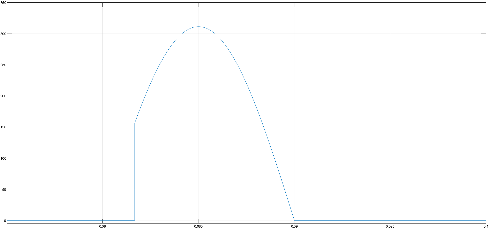
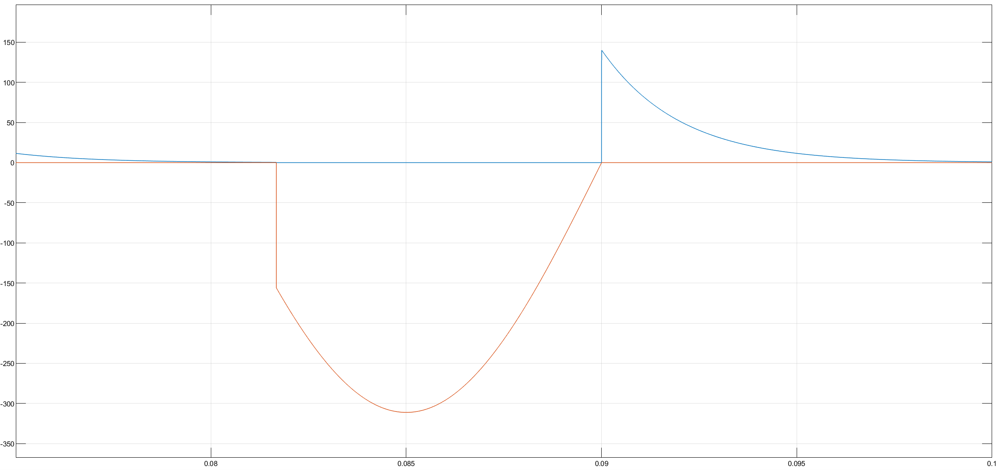

# Single-Phase Controlled Rectifier with Freewheeling Diode

This project presents the simulation and mathematical analysis of a **Single-Phase Half-Wave Controlled Rectifier with a Freewheeling Diode** feeding an RL load. It compares the results obtained from a MATLAB script (Symbolic Toolbox) with a Simulink model.

## 🎓 Project Information
* **Course:** EEM312 Power Electronics
* **Institution:** Sakarya University
* **Term:** Spring 2016
* **Instructor:** Prof. Dr. U. Arifoğlu
* **Topic:** Term Project 1 - Analysis of RL Load with Freewheeling Diode

## 📄 Problem Statement
A thyristor connected to the grid feeds a series RL load. A freewheeling diode is connected in parallel to the load (reverse biased) to maintain current flow when the source voltage reverses.

**System Parameters:**
* **Grid Voltage:** $V_{rms} = 220 \text{ V}$, $f = 50 \text{ Hz}$
* **Load:** $R = 1 \, \Omega$, $L = 2 \text{ mH}$
* **Firing Angle:** $\alpha = 30^\circ$
* **Snubber Circuits:** $R_s = 5000 \, \Omega$, $C_s = 0.25 \, \mu F$ (for both Thyristor and Diode)

**Objectives:**
1.  Calculate the RMS Source Current, RMS Diode Current, RMS Load Current, and Average Load Voltage using MATLAB commands.
2.  Implement the circuit in Simulink and compare the results with the analytical calculation.

## ⚙️ Simulation Settings (Simulink)
The Simulink model is configured with the following solver parameters for accurate power electronics simulation:
* **Solver:** `ode23tb (stiff/TR-BDF2)`
* **Max Step Size:** `auto`
* **Relative Tolerance:** `1e-3`
* **Simulation Mode:** Discrete / Continuous (Specific to `powergui`)

## 🔌 Simulink Model
The following circuit topology was implemented in Simulink using the `Power Systems` blockset.



## 🧮 Mathematical Background
For a single-phase half-wave controlled rectifier with a freewheeling diode:

**1. Source Voltage:**
$$v_s(t) = V_m \sin(\omega t)$$
Where $V_m = 220\sqrt{2}$.

**2. Load Voltage ($v_o$):**
* **Conduction Interval ($\alpha < \omega t < \pi$):** The thyristor is ON, $v_o = v_s$.
* **Freewheeling Interval ($\pi < \omega t < 2\pi + \alpha$):** The diode is ON, load is shorted, $v_o = 0$.

**3. Average Load Voltage ($V_{dc}$):**
$$
V_{dc} = \frac{1}{2\pi} \int_{\alpha}^{\pi} V_m \sin(\omega t) \, d(\omega t) = \frac{V_m}{2\pi} (1 + \cos\alpha)
$$

**4. Current Analysis:**
The current behavior is analyzed in two distinct modes corresponding to the MATLAB code logic:

* **Mode 1: Thyristor Conduction ($\alpha < \omega t < \pi$)**
    The source energizes the load. The current is governed by:
    $$
	V_m \sin(\omega t) = L\frac{di_o}{dt} + R i_o
	$$

* **Mode 2: Freewheeling Diode Conduction ($\pi < \omega t < 2\pi+\alpha$)**
    The source is disconnected, and the stored energy in the inductor circulates through the diode. The source voltage is effectively zero:
    $$
	0 = L\frac{di_o}{dt} + R i_o
	$$

## 💻 MATLAB Code

The following script solves the differential equation for the given parameters ($L=2mH, \alpha=30^\circ$) and calculates the required values.

```matlab
% =========================================================================
% PROJECT: Single-Phase Controlled Rectifier with Freewheeling Diode
% Analytical Solution using MATLAB Symbolic Toolbox
% =========================================================================

clear; clc;

% --- 1. SYSTEM PARAMETERS ---
Vgrid_rms = 220;
Vgrid_max = Vgrid_rms * sqrt(2); % Peak Voltage (Vm)
f = 50;
w = 2 * pi * f;     % Angular frequency (rad/s)
T = 1/f;            % Period (0.02 s)
R = 1;              % Resistance (Ohm)
L = 0.002;          % Inductance (2 mH)
alpha_deg = 30;     % Firing Angle (Degrees)

% Time conversions
t_alpha = (alpha_deg / 360) * T; % Firing time (seconds)
t_pi    = T / 2;                 % Time at 180 degrees (0.01 s)

syms t; % Symbolic time variable

% =========================================================================
% --- 2. INTERVAL 1: THYRISTOR CONDUCTION (Alpha to Pi) ---
% Circuit: Source connected to Load.
% Equation: Vm*sin(w*t) = L(di/dt) + R*i
% =========================================================================

% Define the differential equation for Thyristor ON state
eqn1 = Vgrid_max*sin(w*t) == L*diff(t) + R*t; % Note: 't' here represents current i(t) symbolically in dsolve context implies x(t)

% Correct Symbolic Definition for dsolve:
% We solve for current 'i_thy'
% Initial Condition: Current is 0 at t = t_alpha
str_eqn1 = sprintf('%f*sin(%f*t) = %f*Dy + %f*y', Vgrid_max, w, L, R);
str_ic1  = sprintf('y(%f) = 0', t_alpha);

i_thy_sym = dsolve(str_eqn1, str_ic1, 't');
i_thy = simplify(i_thy_sym);

% Calculate the current value at t = pi (This is the Initial Condition for Diode)
I_at_pi = double(subs(i_thy, t, t_pi));

fprintf('Current at Pi (Transition to Diode): %.4f A\n', I_at_pi);

% =========================================================================
% --- 3. INTERVAL 2: FREEWHEELING DIODE CONDUCTION (Pi onwards) ---
% Circuit: Source disconnected, Load shorted by Diode.
% Equation: 0 = L(di/dt) + R*i
% =========================================================================

% Define Differential Equation for Diode ON state
% Initial Condition: Current starts at I_at_pi when t = t_pi
str_eqn2 = sprintf('0 = %f*Dy + %f*y', L, R);
str_ic2  = sprintf('y(%f) = %f', t_pi, I_at_pi);

i_fwd_sym = dsolve(str_eqn2, str_ic2, 't');
i_fwd = simplify(i_fwd_sym);

% =========================================================================
% --- 4. CALCULATIONS (RMS & AVERAGE VALUES) ---
% =========================================================================

disp('--- CALCULATION RESULTS ---');

% A) RMS VALUE OF SOURCE CURRENT
% Source current flows only when Thyristor is ON (t_alpha to t_pi)
% Formula: sqrt( (1/T) * integral(i_thy^2) )
val_src = int(i_thy^2, t, t_alpha, t_pi);
isource_rms = double(sqrt( (1/T) * val_src ));
fprintf('1. RMS Source Current:       %.2f A\n', isource_rms);

% B) RMS VALUE OF DIODE CURRENT
% Diode current flows from t_pi until it decays to 0.
% Since Tau = L/R = 0.002s, it decays fast. We integrate from t_pi to T (next cycle).
val_dio = int(i_fwd^2, t, t_pi, T); 
idiode_rms = double(sqrt( (1/T) * val_dio ));
fprintf('2. RMS Diode Current:        %.2f A\n', idiode_rms);

% C) RMS VALUE OF LOAD CURRENT
% Load Current = Source Current (Interval 1) + Diode Current (Interval 2)
% Since integrals are additive: Integral_Total = Integral_Src + Integral_Dio
iload_rms = double(sqrt( (1/T) * (val_src + val_dio) ));
fprintf('3. RMS Load Current:         %.2f A\n', iload_rms);

% D) AVERAGE VALUE OF LOAD VOLTAGE
% Voltage is Vm*sin(wt) during Thyristor ON, and 0 during Diode ON.
% Vavg = (1/T) * integral(Vm*sin(wt)) from t_alpha to t_pi
v_load_int = int(Vgrid_max * sin(w*t), t, t_alpha, t_pi);
vload_avg = double( (1/T) * v_load_int );
fprintf('4. Average Load Voltage:     %.2f V\n', vload_avg);

% Analytical Verification for Voltage: Vm/(2pi) * (1 + cos(alpha))
vload_check = (Vgrid_max / (2*pi)) * (1 + cos(alpha_deg*pi/180));
fprintf('   (Analytical Check):       %.2f V\n', vload_check);

```

## 📊 Simulation Results

The simulation results confirm the theoretical analysis.

**1. Load Voltage Output:**
The load voltage follows the source voltage when the thyristor is triggered and becomes zero when the freewheeling diode conducts (after $\pi$).



**2. Freewheeling Diode Behavior:**
The following scope result shows the current transferring to the freewheeling diode when the grid voltage enters the negative cycle.



## 📂 Files
* [Matlab_Calculation.m](Matlab_Calculation.m)
* [Simulink_Simulation.slx](Simulink_Simulation.slx)