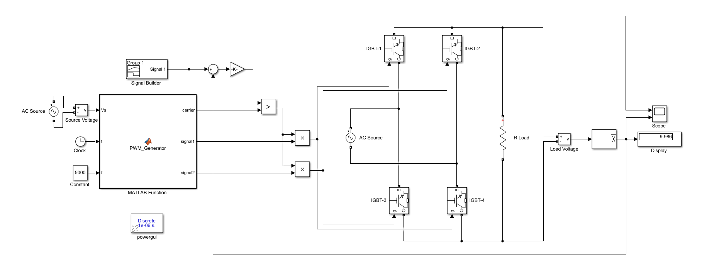
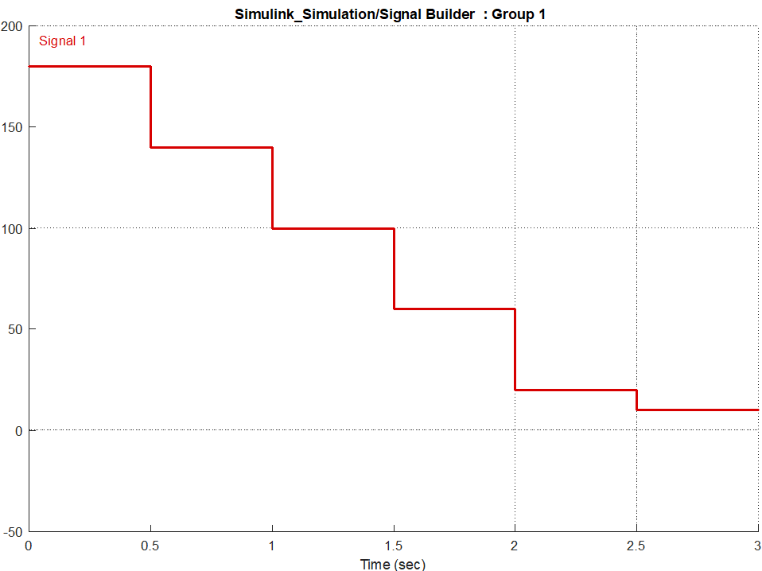
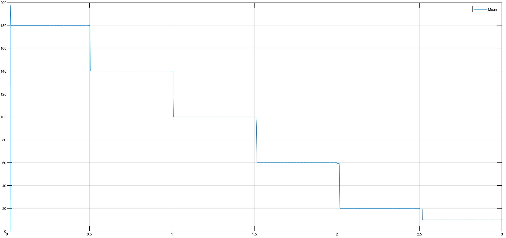
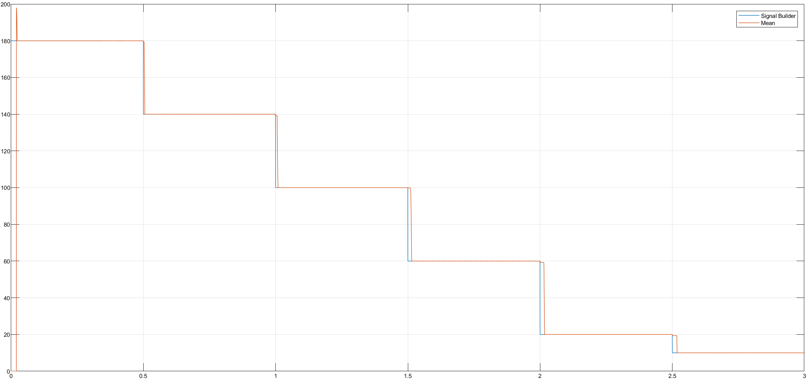

> 🇹🇷 **[Türkçe Versiyon İçin Tıklayınız / Click for Turkish Version](README_TR.md)**

---

# Single-Phase PWM Rectifier with Closed-Loop Control (IGBT)

This project presents the simulation and design of a **Single-Phase PWM Rectifier** using an H-Bridge IGBT topology. The system is designed with a **Closed-Loop Control** strategy to track a varying reference voltage profile.

## 🎓 Project Information

| Field | Details |
| :--- | :--- |
| Course | EEM312 Power Electronics |
| Institution | Sakarya University |
| Term | Spring 2016 |
| Instructor | Prof. Dr. U. Arifoğlu |

## 📄 Problem Statement

The objective is to control the output voltage of a single-phase rectifier feeding a resistive load ($R=10\Omega$). The system must accurately track a step-down reference profile over a 3-second simulation.

### System Parameters

* **Topology:** H-Bridge PWM Rectifier (4 IGBTs)
* **Switching Frequency ($f_{sw}$):** $5 \text{ kHz}$
* **Load:** $R = 10 \, \Omega$
* **Grid:** Single Phase AC
* **Snubber:** $R_s = 100 \, k\Omega$, $C_s = \text{inf}$

### Reference Profile (Target Voltage)

The control loop must track the following values:
* $0.0 - 0.5$ s: **180 V**
* $0.5 - 1.0$ s: **140 V**
* $1.0 - 1.5$ s: **100 V**
* $1.5 - 2.0$ s: **60 V**
* $2.0 - 2.5$ s: **20 V**
* $2.5 - 3.0$ s: **10 V**

### Objective

The primary objective of this project is to design and simulate a **Single-Phase PWM Rectifier** with a closed-loop control system. The specific goals are:

1.  **Closed-Loop Voltage Control:** 

Implement a feedback mechanism to ensure the load voltage accurately tracks a dynamic reference signal (time-varying average voltage profile) requested by the customer.

2.  **Error Minimization:** 

Minimize the steady-state error between the desired reference voltage and the measured average output voltage to ensure precise tracking.

3.  **PWM Generation:** 

Design an Embedded MATLAB Function to generate PWM signals using a **5 kHz** triangular carrier wave frequency.

4.  **Simulation Verification:** 

Validate the control system's performance by matching the simulation output (Mean Voltage Scope) with the provided reference results.

## 🧮 Mathematical Background

The control logic of the PWM rectifier relies on the **Sinusoidal Pulse Width Modulation (SPWM)** principle, which is manually implemented in the Embedded MATLAB Function.

**1. Triangular Carrier Wave Generation:**
Instead of a pre-built block, the carrier wave $v_{tri}(t)$ is generated mathematically using linear equations. For a switching frequency $f_{sw}$ and amplitude $V_{tri}$, the instantaneous value is calculated based on the slope $m$:

$$m = 2 \cdot f_{sw} \cdot V_{tri}$$

Depending on the time $t$ within the period $T$, the wave is defined as:
* **Rising Edge:** $v_{tri}(t) = m \cdot (t - t_{start}) + V_{min}$
* **Falling Edge:** $v_{tri}(t) = -m \cdot (t - t_{peak}) + V_{max}$

**2. PWM Switching Logic:**
The switching signals are generated by comparing the control signal $V_{control}$ (derived from the error) with the carrier wave $v_{tri}$.

* If $V_{control} > v_{tri} \implies S_1, S_2 \text{ ON}$ (Source connected to Load)
* If $V_{control} < v_{tri} \implies S_3, S_4 \text{ ON}$ (Zero/Inverted state)

**3. Average Output Voltage:**
By varying the duty cycle $D$ (the ratio of ON time to the total period $T$) via the control signal, the average output voltage $V_{dc}$ is controlled:

$$V_{dc} = \frac{1}{T} \int_{0}^{T} v_{o}(t) \, dt$$

The closed-loop system adjusts $V_{control}$ to modify $D$, ensuring that $V_{dc}$ tracks the reference voltage steps ($180V \rightarrow 10V$).

## ⚙️ System Topology & Simulation Model

### Circuit Diagram & Simulink Model

The circuit consists of a single-phase AC source, an IGBT H-Bridge, and a resistive load. A feedback loop compares the measured output voltage with the reference signal to adjust the PWM duty cycle.



###  Simulation Parameters

The Simulink model is configured with the following solver parameters for accurate power electronics simulation:

| Field | Details |
| :--- | :--- |
| Solver | `ode23tb (stiff/TR-BDF2)` |
| Simulation Time | `3.0` s |
| Powergui | Discrete, $T_s = 1e-6$ s |

## 💻 Control Algorithm & Implementation

The following code is implemented inside the **Embedded MATLAB Function** block to generate the PWM signals. It creates a triangular carrier wave internally and compares it with the control signal ($V_s$).

### Embedded MATLAB Code (PWM Generator)

```matlab
function [e, isaret1, isaret2] = periyodik(Vs, t, f)
    % This program generates a triangular wave within period T/2
    % and acts as a PWM comparator.

    % --- Initialization ---
    isaret1 = 0;
    isaret2 = 0;
    
    T = 1/f;      % Period (e.g., 1/5000 = 200us)
    V = 1;        % Amplitude of triangular wave
    m = 2*f*V;    % Slope of the triangular wave
    e = 0;        % Carrier wave value initialization
    
    b = fix(t/T); % Determine the current cycle index

    % --- Triangular Wave Generation ---
    % Rising Edge
    if (t >= b*T) && (t <= (b+0.5)*T)
        e = m * (t - (b + 0.5)*T) + V;
    end
    
    % Falling Edge
    if (t > (0.5+b)*T) && (t <= (b+1)*T)
        e = -m * (t - (b + 0.5)*T) + V;
    end
    
    e = abs(e); % Ensure positive magnitude for comparison

    % --- PWM Logic (Comparator) ---
    % Vs is the Control Signal (Error/Reference)
    % e is the Carrier Signal
    
    if Vs > e
        isaret1 = 1; % Turn ON IGBT Pair 1 (S1, S2)
        isaret2 = 0;
    else
        isaret1 = 0; % Turn OFF
        isaret2 = 1; % Turn ON IGBT Pair 2 (S3, S4)
    end
end

```

### Code Logic & Explanation

The code manually implements the **SPWM (Sinusoidal Pulse Width Modulation)** logic without using standard Simulink PWM blocks. Here is the detailed breakdown:

* **Carrier Generation:** Instead of using a Repeating Sequence block, the code mathematically constructs the instantaneous value of a triangular wave (**carrier**) using the system time `t` and frequency `f` (5000 Hz). It uses the linear equation $y = mx + c$ to draw the rising and falling slopes with an amplitude of 1V.
* **Comparator Logic:** The code acts as a relational operator comparing the control signal ($V_s$) from the controller with the generated carrier wave ($e$):
    * **When $V_s > \text{Carrier}$:** The output `signal1` is High. This turns ON **IGBTs 1 & 2**, connecting the source to the load.
    * **When $V_s < \text{Carrier}$:** The output `signal2` is High. This turns ON **IGBTs 3 & 4**, applying the inverted voltage (or zero) depending on the switching scheme.

**Result:** This modulation varies the width of the voltage pulses applied to the load. A higher control voltage results in wider pulses, increasing the average output voltage ($V_{dc}$), which allows the system to track the reference steps accurately.


## 📊 Results & Discussion

**1. Reference Voltage Profile:**
The target voltage profile is defined using a Signal Builder block. It requires the system to step down from **180V to 10V** over a 3-second interval.



**2. Load Voltage Response:**
The measured average load voltage ($V_{dc}$) is shown below. The system successfully adjusts the PWM duty cycle to maintain the desired voltage levels at each step (180V, 140V, 100V, 60V, 20V, 10V).



**3. Tracking Performance (Reference vs. Output):**
Superimposing the reference signal (Blue) and the measured mean output voltage (Red) demonstrates the effectiveness of the closed-loop control. The tracking error is minimal, and the system responds rapidly to step changes.



## 📂 Project Files

* [Matlab_PWM_Generator.m](Matlab_PWM_Generator.m) - MATLAB script for initializing variables (if used).
* [Simulink_Simulation.mdl](Simulink_Simulation.mdl) - The main Simulink model file.