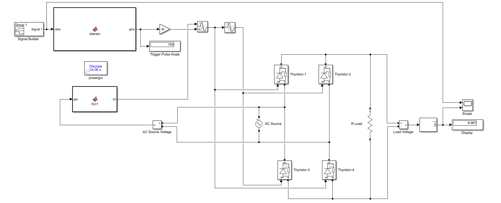
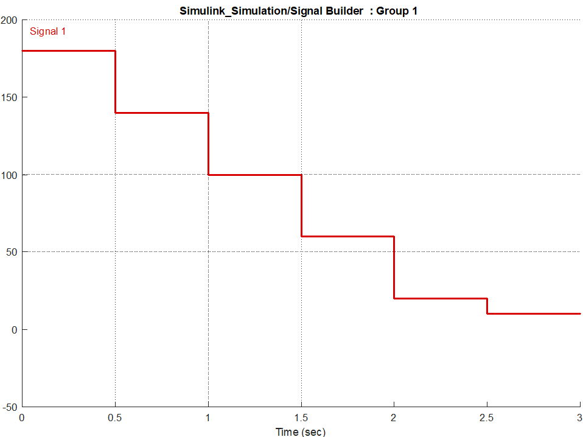
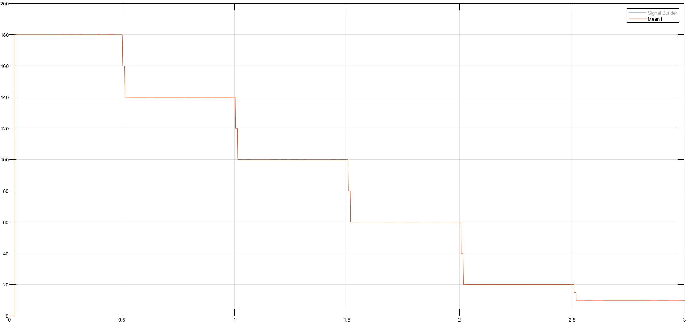
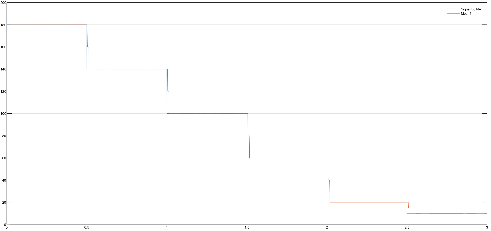

# Single-Phase Controlled Rectifier (Thyristor) with Closed-Loop Control

This project presents the simulation and design of a **Single-Phase Full-Wave Fully Controlled Rectifier** using Thyristors. Unlike open-loop systems, this design employs a **Closed-Loop Control** strategy that dynamically calculates the firing angle ($\alpha$) to track a specific reference voltage profile.

## 📄 System Description
The topology consists of a Full-Wave Bridge (Graetz) with 4 Thyristors feeding a resistive load ($R=10\Omega$).

**Control Logic:**
The system reads the desired average voltage ($V_{ref}$) from a Signal Builder and calculates the precise firing angle ($\alpha$) required to achieve that voltage using a numerical method (Newton-Raphson).
* **T1 & T2:** Triggered during the positive half-cycle.
* **T3 & T4:** Triggered during the negative half-cycle.

**System Parameters:**
* **Grid:** Single Phase, 50 Hz, 220V RMS
* **Load:** Resistive, $R = 10 \, \Omega$
* **Target Profile:** Step-down voltage profile (180V $\to$ 10V).

## 🧮 Mathematical Background

The core challenge in this control loop is determining the correct firing angle $\alpha$ for a requested DC voltage.

**1. Voltage-Angle Relationship:**
For a single-phase full-wave rectifier with a resistive load, the average output voltage $V_{dc}$ is related to the firing angle $\alpha$ by the following non-linear equation:

$$V_{dc} = \frac{V_m}{\pi} (1 + \cos\alpha)$$


Where $V_m$ is the peak voltage ($220\sqrt{2}$).

**2. The Inverse Problem (Calculating $\alpha$):**
To find $\alpha$ for a given $V_{ref}$, we need to solve the equation for $\alpha$. While this can be done analytically, the implemented code uses the **Newton-Raphson Method** to find the root iteratively. This is robust and allows for high precision.

The iteration formula used in the code is:

$$\alpha_{n+1} = \alpha_n - \frac{f(\alpha_n)}{f'(\alpha_n)}$$

Where the function to minimize is the error between calculated and reference voltage.

## 🔌 Circuit Diagram
The Simulink model below implements the closed-loop control system. It features:
1.  **Signal Builder:** Generates the reference voltage steps.
2.  **Alpha Calculator (Embedded MATLAB):** Computes the firing angle.
3.  **Synchronization (Zero-Crossing):** Detects grid polarity to switch between thyristor pairs.



## 💻 Embedded MATLAB Functions

### 1. Alpha Calculation (Newton-Raphson)
This block receives the reference voltage (`cikis`) and calculates the required firing angle (`giris`) using an iterative loop.

```matlab
function alpha_deg = Calculate_Alpha(V_ref)
    % Initialization of variables
    phi = 2;              % Initial guess for the angle (radians)
    eps_tol = 0.00001;    % Epsilon tolerance
    max_iter = 20;        % Maximum number of iterations
    diff_tol = 0.000001;  % Difference threshold
    alpha_deg = 0;        % Output angle initialization
    f_val = 0;            % Function value
    
    Vm = 220 * sqrt(2);   % Peak Voltage (Vm)
    
    % Newton-Raphson Loop
    for k = 1:max_iter
        % Derivative of the voltage equation: b = f'(phi)
        deriv = (Vm / pi) * sin(phi); 
        
        % Update rule: alpha = phi - f(phi)/f'(phi)
        % Equation being solved: V_ref - (Vm/pi)*(1 + cos(phi)) = 0
        numerator = -(Vm / pi) * (cos(phi) + 1) + V_ref;
        alpha_deg = phi - numerator / deriv;  
        
        % Error Calculation
        err_abs = abs(alpha_deg - phi);
        err_rel = 2 * err_abs / (abs(alpha_deg) + diff_tol);
        
        % Update phi for next step
        phi = alpha_deg;
        
        % Recalculate function residual
        f_val = -(Vm / pi) * (cos(phi) + 1) + V_ref;
        
        % Convergence Check
        if (err_abs < diff_tol) || (err_rel < diff_tol) || (abs(f_val) < eps_tol)
            break
        end 
    end
    
    % Convert result from Radians to Degrees
    alpha_deg = alpha_deg * 180 / pi;
end

```

### 2. Zero Crossing Detection
This block monitors the AC source voltage to determine the current half-cycle (Positive or Negative) for synchronization.

```matlab
function output_signal = Zero_Crossing_Detector(input_voltage)
    % Checks if the input voltage is positive
    
    R = 10;             % Resistance (Ohm)
    epsilon = 0.000001; % Epsilon tolerance
    
    if input_voltage > 0
        output_signal = 1;
    else
        output_signal = 0;
    end
end

```

## 📊 Simulation Results

**1. Reference Voltage Profile:**
The target voltage profile is defined using a Signal Builder block. It requires the system to step down from **180V to 10V** over a 3-second interval.



**2. Measured Load Voltage:**
The graph below shows the measured average voltage across the load. The system successfully adjusts the firing angle to maintain the voltage levels (180V, 140V, ..., 10V) as requested.



**3. Tracking Performance:**
The graph below compares the **Reference Signal (Blue)** with the **Measured Average Load Voltage (Red)**.
The system successfully adjusts the firing angle $\alpha$ to match the requested voltage levels. For example:
* At **0-0.5s** (Target 180V): The angle $\alpha$ is small, allowing high conduction.
* At **2.5-3.0s** (Target 10V): The angle $\alpha$ is close to $180^\circ$, significantly chopping the waveform.



## 📂 Files
* [Simulink_Simulation.mdl](Simulink_Simulation.mdl)
* [Matlab_Function_Block.m](Matlab_Function_Block.m)
* [Matlab_Zero_Crossing_Detector.m](Matlab_Zero_Crossing_Detector.m)