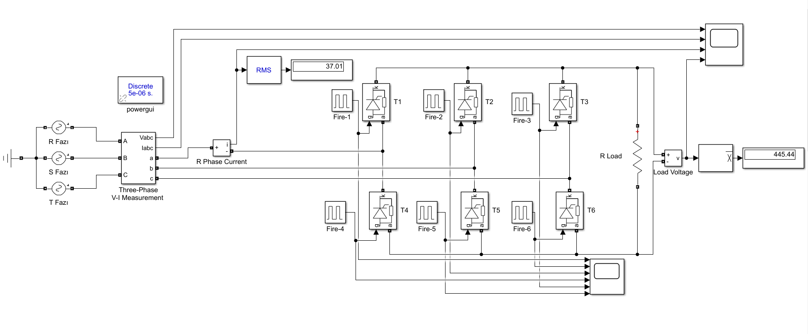
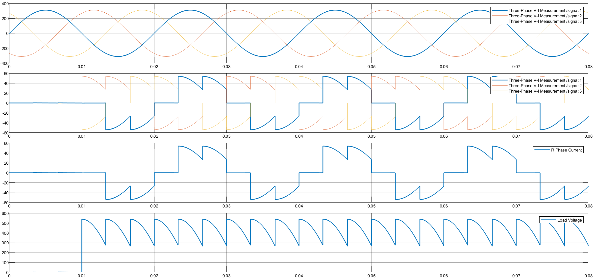
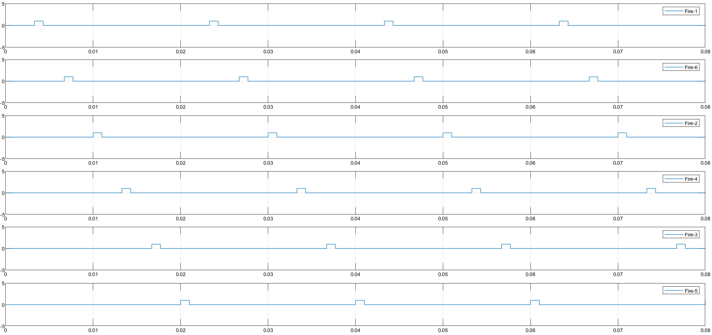
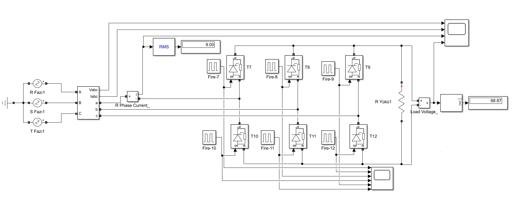
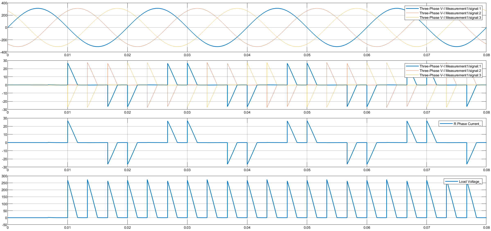
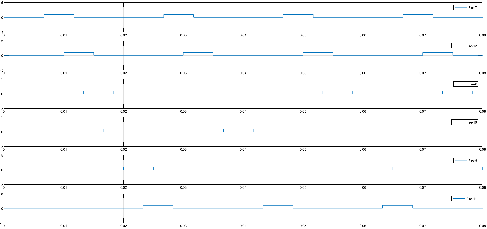

# Three-Phase Full-Wave Controlled Rectifier with Resistive Load

This project presents the simulation and mathematical analysis of a **Three-Phase Full-Wave Fully Controlled Rectifier (Graetz Bridge)** connected to a **Resistive (R) Load**.

## 🎓 Project Information
* **Course:** EEM312 Power Electronics
* **Institution:** Sakarya University
* **Term:** Spring 2016
* **Instructor:** Prof. Dr. U. Arifoğlu
* **Topic:** Term Project 3 - Three-Phase Full Bridge Rectifier

## 📄 Problem Statement
A three-phase full-wave controlled rectifier is connected to a 3-phase grid ($380V_{L-L}$) and feeds a resistive load.

**System Parameters:**
* **Grid Voltage:** $V_{L-L(rms)} = 380 \text{ V}$, $f = 50 \text{ Hz}$
* **Load:** $R = 10 \, \Omega$
* **Snubber Circuits:** $R_s = 5000 \, \Omega$, $C_s = 250 \, \mu F$

**Tasks:**
The analysis is performed for two different firing angles:
1.  **Case A:** $\alpha = 30^\circ$ (Continuous Conduction)
2.  **Case B:** $\alpha = 90^\circ$ (Discontinuous Conduction for R-Load)

For each case, the **Average Load Voltage ($V_{dc}$)** and **RMS Source Current (Phase A)** are calculated.

## ⚙️ Simulation Settings (Simulink)
The Simulink model is configured with the following parameters:
* **Solver:** `ode23t (mod. stiff/Trapezoidal)`
* **Stop Time:** `0.08` s
* **Powergui:** Discrete, $T_s = 5e-6$ s

## 🧮 Mathematical Background
The rectifier output voltage depends on the firing angle $\alpha$ and the load type.

**1. Peak Line Voltage:**

$$V_{m,LL} = 380\sqrt{2} \approx 537.4 \text{ V}$$

**2. Case 1: $\alpha = 30^\circ$ (Continuous Mode):**
Since $\alpha < 60^\circ$, the load current is continuous.

$$V_{dc} = \frac{3V_{m,LL}}{\pi} \cos(\alpha)$$

**3. Case 2: $\alpha = 90^\circ$ (Discontinuous Mode):**
For a resistive load, if $\alpha > 60^\circ$, the current becomes discontinuous because the line voltage goes to zero before the next thyristor is triggered.
* **Conduction Start:** $\pi/3 + \alpha$
* **Conduction End:** $\pi$ (Zero crossing)

$$V_{dc} = \frac{3}{\pi} \int_{\pi/3+\alpha}^{\pi} V_{m,LL} \sin(\omega t) \, d(\omega t)$$

## 💻 MATLAB Code

The following script calculates the required values for both cases.

```matlab
% =========================================================================
% PROJECT 03: 3-Phase Full-Wave Controlled Rectifier (Resistive Load)
% Analytical Solution using MATLAB Symbolic Toolbox
% Cases: Alpha = 30 deg and Alpha = 90 deg
% =========================================================================

clear; clc;

% --- 1. SYSTEM PARAMETERS ---
V_LL_rms = 380;                  % Line-to-Line RMS Voltage (V)
Vm_LL = V_LL_rms * sqrt(2);      % Peak Line-to-Line Voltage (V)
R = 10;                          % Load Resistance (Ohm)
syms wt;                         % Symbolic variable for angle (omega * t)

fprintf('--- PROJECT 03 CALCULATION RESULTS ---\n');

% =========================================================================
% --- CASE 1: Alpha = 30 Degrees (Continuous Conduction) ---
% =========================================================================
alpha1_deg = 30;
alpha1_rad = deg2rad(alpha1_deg);

% In 3-Phase Full Converter, periodicity is pi/3 (60 degrees).
% For R load, if alpha < 60, conduction is Continuous.
% Integration limits: from (alpha + pi/3) to (alpha + 2*pi/3)
% Reference Voltage: Line-to-Line Voltage Vab = Vm_LL * sin(wt + pi/6) 
% (Standard reference shifting for correct limits)

fprintf('\n>>> CASE 1: Alpha = %d degrees (Continuous Mode)\n', alpha1_deg);

% Average Load Voltage (Vdc)
% Vdc = (3/pi) * integral of Vm_LL * sin(wt) from alpha+pi/3 to alpha+2pi/3
% Simplified Formula for Continuous: Vdc = (3*Vm_LL/pi) * cos(alpha)
Vdc_1 = (3 * Vm_LL / pi) * cos(alpha1_rad);
fprintf('1. Average Load Voltage (Vdc):   %.2f V\n', Vdc_1);

% RMS Source Current (Is_rms) calculation is complex symbolically for 
% specific phase shifting, approximating for Resistive Load:
% Power Balance: P_dc = V_rms_load^2 / R = P_ac (approx)
% Output RMS Voltage for Full Wave:
V_load_rms_1 = Vm_LL * sqrt( (3/(2*pi)) * (pi/3 + 0.5*sqrt(3)*cos(2*alpha1_rad)) );
P_load_1 = (V_load_rms_1^2) / R;
% Total Power = sqrt(3) * V_LL * Is_rms * PF
% Instead, calculating Is_rms directly from load current relation:
% I_rms_load = V_load_rms_1 / R.
% For 3-ph full bridge, Source Current rms (Is) = I_load_rms * sqrt(2/3) (for constant current)
% But for R-load, wave shape matters.
% Integration method:
i_out_1 = (Vm_LL * sin(wt)) / R;
% Integration limits for one pulse (60 deg): pi/3+alpha to 2pi/3+alpha
val_i2 = int(i_out_1^2, wt, pi/3+alpha1_rad, 2*pi/3+alpha1_rad);
% This is energy in one 60-deg pulse. Source conducts for 2 pulses per half cycle (positive and negative).
% Actually source current flows for 120 deg in each half cycle (2 pulses).
Is_rms_1 = double(sqrt( (1/pi) * val_i2 )); % Averaged over pi
fprintf('2. RMS Phase Current (Is):       %.2f A\n', Is_rms_1);


% =========================================================================
% --- CASE 2: Alpha = 90 Degrees (Discontinuous Conduction) ---
% =========================================================================
alpha2_deg = 90;
alpha2_rad = deg2rad(alpha2_deg);

fprintf('\n>>> CASE 2: Alpha = %d degrees (Discontinuous Mode)\n', alpha2_deg);

% For R load, if alpha > 60, current becomes Discontinuous.
% Conduction starts at: alpha + 30 deg (relative to crossing) -> Here pi/3 + alpha
% Conduction ends at: pi (180 deg) when line voltage goes negative.
% Wait, standard limits: alpha+pi/3 to pi (zero crossing of line voltage)

% Integration Limits:
theta_start = alpha2_rad + pi/3; 
theta_end = pi; % V_line goes to zero at pi

% Average Load Voltage
v_inst = Vm_LL * sin(wt);
Vdc_sym_2 = (3/pi) * int(v_inst, wt, theta_start, theta_end);
Vdc_2 = double(Vdc_sym_2);
fprintf('1. Average Load Voltage (Vdc):   %.2f V\n', Vdc_2);

% RMS Source Current
% Current flows only during conduction intervals.
i_inst_2 = (Vm_LL * sin(wt)) / R;
val_i2_case2 = int(i_inst_2^2, wt, theta_start, theta_end);
% Source current conducts for 2 such pulses in a half cycle (normally), 
% but due to discontinuity, we integrate the energy.
Is_rms_2 = double(sqrt( (1/pi) * val_i2_case2 ));
fprintf('2. RMS Phase Current (Is):       %.2f A\n', Is_rms_2);

```

## 📊 Simulation Results

The simulation results confirm the theoretical analysis for both continuous and discontinuous conduction modes.

**1. Case A: Firing Angle $\alpha = 30^\circ$ (Continuous Mode)**
Since $\alpha < 60^\circ$ with a resistive load, the system operates in continuous conduction mode.
* **Average Load Voltage:** 445.44 V
* **RMS Phase Current:** 37.01 A



The scope results below show the continuous load voltage, source currents, and the corresponding thyristor firing sequences.




**2. Case B: Firing Angle $\alpha = 90^\circ$ (Discontinuous Mode)**
Since $\alpha > 60^\circ$ with a resistive load, the system operates in discontinuous conduction mode. The load voltage drops to zero before the next triggering pulse.
* **Average Load Voltage:** 68.87 V
* **RMS Phase Current:** 9.00 A



The scope results below clearly illustrate the discontinuous nature of the output voltage and current.




## 📂 Files
* [Matlab_Calculation.m](Matlab_Calculation.m)
* [Simulink_Simulation.mdl](Simulink_Simulation.mdl)