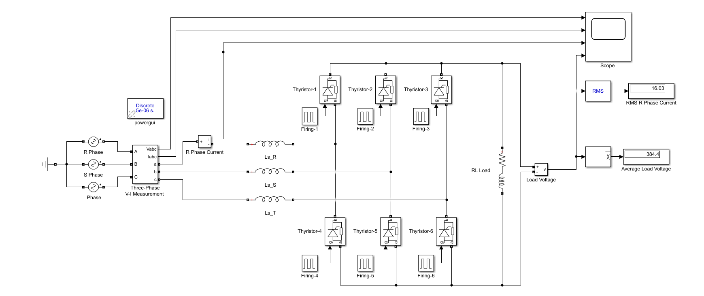
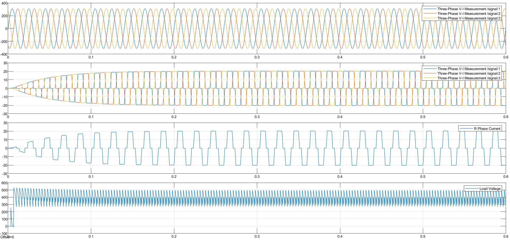

> 🇹🇷 **[Türkçe Versiyon İçin Tıklayınız / Click for Turkish Version](README_TR.md)**

---

# Three-Phase Full-Wave Rectifier with Source Inductance

This project presents the simulation and mathematical analysis of a **Three-Phase Full-Wave Fully Controlled Rectifier (Graetz Bridge)** considering the effect of **Source Inductance ($L_s$)**. The system feeds a series RL load.

## 🎓 Project Information

| Field | Details |
| :--- | :--- |
| Course | EEM312 Power Electronics |
| Institution | Sakarya University |
| Term | Spring 2016 |
| Instructor | Prof. Dr. U. Arifoğlu |

## 📄 Problem Statement

The rectifier is connected to a 3-phase grid ($380V_{L-L}$) through source inductances. The presence of $L_s$ causes **commutation overlap**, resulting in a voltage drop at the output.

### System Parameters

* **Grid Voltage:** $V_{rms} = 380 \text{ V}$ (Line-to-Line), $f = 50 \text{ Hz}$
* **Source Inductance:** $L_s = 10 \text{ mH}$ (per phase)
* **Load:** $R_y = 19.2 \, \Omega$, $L_y = 1 \text{ H}$
* **Target Load Current:** $\approx 20 \text{ A}$ (Continuous)
* **Firing Angle:** $\alpha = 30^\circ$

### Objective

1.  Calculate and simulate the Average Load Voltage ($V_{dc}$) accounting for the commutation drop.
2.  Calculate and simulate the RMS Phase Current.
3.  Observe the 6-pulse commutation notches in the voltage waveform.

## 🧮 Mathematical Background

In a 3-phase full converter with source inductance, commutation occurs 6 times per cycle. The output voltage is reduced by the voltage drop across $L_s$.

**1. Average Load Voltage ($V_{dc}$):**

$$V_{dc} = V_{dc(\text{no-loss})} - \Delta V_x$$


$$V_{dc} = \frac{3\sqrt{2} V_{LL}}{\pi} \cos(\alpha) - \frac{3 \omega L_s I_d}{\pi}$$

**2. Commutation Angle ($\mu$):**
The overlap angle $\mu$ can be found using:

$$\cos(\alpha + \mu) = \cos(\alpha) - \frac{2 \omega L_s I_d}{\sqrt{2} V_{LL}}$$

## ⚙️ System Topology & Simulation Model

The following circuit topology was implemented.

### Circuit Diagram & Simulink Model

It consists of a 6-pulse thyristor bridge supplied by a 3-phase source with series inductances ($L_s$).



###  Simulation Parameters

The Simulink model is configured with the following parameters:

| Field | Details |
| :--- | :--- |
| Solver | `ode23t (mod. stiff/Trapezoidal)` |
| Stop Time | `0.6` s |
| Powergui | Discrete, $T_s = 5e-6$ s |

## 💻 Control Algorithm & Implementation


### MATLAB Code

```matlab
% =========================================================================
% PROJECT 06: 3-Phase Full-Wave Rectifier with Source Inductance
% Analytical Solution using MATLAB Symbolic Toolbox
% =========================================================================

clear; clc;

% --- 1. SYSTEM PARAMETERS ---
f = 50;
w = 2 * pi * f;           % Angular frequency (rad/s)
Ls = 0.01;                % Source Inductance (10 mH)
I_load = 20;              % Target Load Current (Assumed Constant 20A)
V_LL_rms = 380;           % Line-to-Line RMS Voltage
Vm_LL = V_LL_rms * sqrt(2); % Peak Line-to-Line Voltage (Vm)
alpha_deg = 30;           % Firing Angle
alpha_rad = deg2rad(alpha_deg);

fprintf('--- PROJECT 06 CALCULATION RESULTS ---\n');
fprintf('Source Inductance (Ls): %.3f H\n', Ls);
fprintf('Load Current (Id):      %.1f A\n', I_load);

% --- 2. COMMUTATION ANGLE CALCULATION (Mu) ---
% For 3-Phase Full Bridge, commutation is governed by Line Voltage.
% Formula: cos(alpha + mu) = cos(alpha) - (2*w*Ls*Id) / (Vm_LL)

val_cos_alpha_mu = cos(alpha_rad) - ((2 * w * Ls * I_load) / Vm_LL);
alpha_plus_mu = acos(val_cos_alpha_mu); % This is (alpha + mu)
mu_rad = alpha_plus_mu - alpha_rad;     % Commutation Angle (radians)
mu_deg = rad2deg(mu_rad);               % Commutation Angle (degrees)

fprintf('Commutation Angle (mu): %.2f degrees\n', mu_deg);

% --- 3. AVERAGE LOAD VOLTAGE (Vdc) ---
% Formula for Full Converter with overlap:
% Vdc = (3*Vm_LL / pi) * cos(alpha) - (3*w*Ls*Id / pi)
% Term 1: Ideal Voltage
% Term 2: Voltage Drop due to Commutation (3*w*Ls*Id/pi)

V_ideal = (3 * Vm_LL / pi) * cos(alpha_rad);
V_drop  = (3 * w * Ls * I_load) / pi;
V_load_avg = V_ideal - V_drop;

fprintf('1. Average Load Voltage:    %.2f V\n', V_load_avg);

% --- 4. RMS SOURCE CURRENT (Is_rms) ---
% In a 3-Phase Full Converter, current flows in two pulses per cycle 
% (Positive and Negative), each lasting 120 degrees (2*pi/3).
% With Ls, the pulses are trapezoidal (rising edge mu, flat top, falling edge mu).

% Ideal RMS (without Ls) approximation:
I_ideal_rms = I_load * sqrt(2/3); 
fprintf('   (Ideal Rectangular RMS): %.2f A\n', I_ideal_rms);

% Exact RMS with Commutation:
syms theta; 

% Current equation during rising commutation (from 0 to Id)
% Driven by Line Voltage commutation loop
% i_rise(theta) = (Vm_LL / (2*w*Ls)) * (cos(alpha) - cos(theta))
% Valid for theta from alpha to alpha+mu
coeff = Vm_LL / (2 * w * Ls);
i_rising = coeff * (cos(alpha_rad) - cos(theta));

% Energy Calculation:
% 1. Rising Edge (alpha to alpha+mu)
E_rise = int(i_rising^2, theta, alpha_rad, alpha_plus_mu);

% 2. Flat Top (Conduction)
% Total pulse width is 120 deg (2*pi/3). Flat part = 2*pi/3 - mu
theta_flat = (2*pi/3) - mu_rad;
E_flat = (I_load^2) * theta_flat;

% 3. Falling Edge
% i_fall = I_load - i_rising
E_fall = int((I_load - i_rising)^2, theta, alpha_rad, alpha_plus_mu);

% Total RMS Calculation
% Source current has 2 pulses (positive and negative) in one period (2*pi)
% I_rms = sqrt( (1/2pi) * 2 * (E_rise + E_flat + E_fall) )
val_integral_total = double(E_rise + E_flat + E_fall);
I_source_rms = sqrt((2 / (2 * pi)) * val_integral_total);

fprintf('2. RMS Source Current:      %.2f A\n', I_source_rms);

```

## 📊 Results & Discussion

The simulation confirms the theoretical voltage drop due to source inductance.

**1. Waveform Analysis:**
The system produces a 6-pulse output voltage. Due to $L_s$, the voltage transitions are not instantaneous, creating "notches" (momentary drops) in the output voltage waveform every $60^\circ$.



## 📂 Project Files

* [Matlab_Calculation.m](Matlab_Calculation.m) - MATLAB script for initializing variables.
* [Simulink_Simulation.mdl](Simulink_Simulation.mdl) - The main Simulink model file.