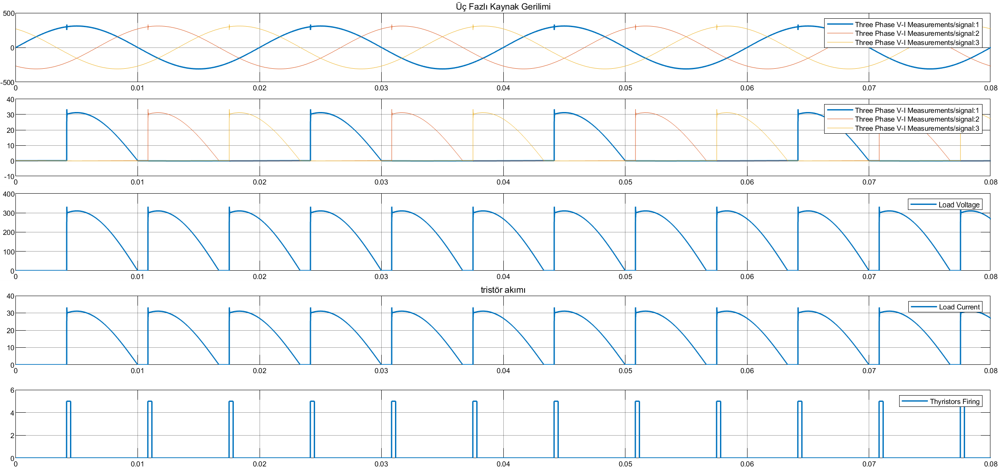

# Three-Phase Half-Wave Controlled Rectifier with Resistive Load

This project presents the simulation and mathematical analysis of a **Three-Phase Half-Wave Controlled Rectifier** connected to a **Resistive (R) Load**. The system is supplied directly from a 3-phase grid.

## 🎓 Project Information
* **Course:** EEM312 Power Electronics
* **Institution:** Sakarya University
* **Term:** Spring 2016
* **Instructor:** Prof. Dr. U. Arifoğlu
* **Topic:** Term Project 2 - Three-Phase Rectifier with Resistive Load

## 📄 Problem Statement
A three-phase half-wave controlled rectifier is connected to a 3-phase grid ($380V_{L-L}$) and feeds a resistive load.

**System Parameters:**
* **Grid Voltage:** $V_{L-L(rms)} = 380 \text{ V}$, $f = 50 \text{ Hz}$
* **Load:** $R = 10 \, \Omega$
* **Firing Angle:** $\alpha = 45^\circ$
* **Snubber Circuits:** $R_s = 5000 \, \Omega$, $C_s = 250 \, \mu F$ (per thyristor)

**Objectives:**
1.  Calculate the Total Active Power consumed by the load ($P_{load}$).
2.  Calculate the Total Active Power drawn from the 3-phase grid ($P_{grid}$).
3.  Perform analytical calculations using MATLAB Symbolic Toolbox.

## ⚙️ Simulation Settings (Simulink)
The Simulink model is configured with the following solver parameters:
* **Solver:** `ode23tb (stiff/TR-BDF2)`
* **Max Step Size:** `auto`
* **Relative Tolerance:** `1e-3`
* **Stop Time:** `0.08` s
* **Powergui:** Discrete, $T_s = 5e-6$ s

## 🧮 Mathematical Background
For a three-phase half-wave rectifier with a resistive load and $\alpha = 45^\circ$:

**1. Phase Voltages:**
The phase-to-neutral voltage peak ($V_m$) is derived from the line-to-line RMS voltage:
$$V_{phase(rms)} = \frac{380}{\sqrt{3}} \approx 220 \text{ V}$$
$$V_m = 220\sqrt{2} \approx 311 \text{ V}$$

**2. Conduction Mode:**
Since the firing angle $\alpha = 45^\circ$ is greater than $30^\circ$, and the load is purely resistive, the current becomes **discontinuous**.
* **Start of Conduction:** $\theta_1 = 30^\circ + \alpha = 75^\circ$
* **End of Conduction:** $\theta_2 = 180^\circ$ (Voltage crosses zero)

**3. Active Power Calculation:**
The average power is calculated by integrating the instantaneous power over one period ($T_{period} = 2\pi/3$ for 3-phase output):
$$P_{avg} = \frac{3}{2\pi} \int_{30^\circ+\alpha}^{180^\circ} \frac{(V_m \sin \omega t)^2}{R} \, d(\omega t)$$

## 💻 MATLAB Code

The following script calculates the active power for the resistive load under discontinuous conduction.

```matlab
% =========================================================================
% PROJECT 02: 3-Phase Half-Wave Controlled Rectifier (Resistive Load)
% Analytical Solution using MATLAB Symbolic Toolbox
% =========================================================================

clear; clc;

% --- 1. SYSTEM PARAMETERS ---
V_LL_rms = 380;                  % Line-to-Line RMS Voltage (V)
V_ph_rms = V_LL_rms / sqrt(3);   % Phase-to-Neutral RMS Voltage (V)
Vm = V_ph_rms * sqrt(2);         % Peak Phase Voltage (V)

R = 10;                          % Load Resistance (Ohm)
alpha_deg = 45;                  % Firing Angle (Degrees)
alpha_rad = deg2rad(alpha_deg);  % Firing Angle (Radians)

syms wt; % Symbolic variable for angle (omega * t)

% --- 2. DEFINE CONDUCTION INTERVALS ---
% For 3-Phase Half-Wave with R-Load:
% Natural commutation point is at 30 degrees (pi/6).
% Firing instant: theta_start = 30 + alpha
% Extinction instant: For R load, current stops when Vphase < 0 (at 180 degrees/pi).
% Check if alpha implies discontinuous mode (alpha > 30 for R-load in 3-ph half-wave)

theta_start = (pi/6) + alpha_rad; 
theta_end   = pi; % Due to Resistive load, conduction stops at zero crossing.

% --- 3. CALCULATE POWER ---
% Instantaneous Power p(t) = v(t)^2 / R
% We integrate over one output pulse (which repeats 3 times per grid cycle).
% The factor 3/(2*pi) averages it over the full grid cycle (2*pi).

p_inst = (Vm * sin(wt))^2 / R;

% Calculate Average Active Power (P_load)
P_load_sym = (3 / (2*pi)) * int(p_inst, wt, theta_start, theta_end);
P_load = double(P_load_sym);

fprintf('--- CALCULATION RESULTS ---\n');
fprintf('1. Total Active Power Absorbed by Load: %.2f W\n', P_load);

% For a pure rectifier without losses, Grid Power = Load Power
fprintf('2. Total Active Power Drawn from Grid:  %.2f W\n', P_load);

% --- Validation Parameters for Simulink ---
fprintf('\n--- VALIDATION PARAMETERS ---\n');
fprintf('Phase Voltage Peak (Vm): %.2f V\n', Vm);
fprintf('Start Angle (deg):       %.2f\n', rad2deg(theta_start));
fprintf('End Angle (deg):         %.2f\n', rad2deg(theta_end));

```

## 📊 Simulation Results

The simulation confirms the theoretical analysis. As seen in the circuit diagram, the measured Total Active Power is **4777.84 W**.

**Waveform Analysis:**
The scope output below visualizes the system behavior including Source Voltages, Source Currents, Load Voltage, Thyristor Currents, and Firing Pulses.



## 📂 Files
* [Matlab_Calculation.m](Matlab_Calculation.m)
* [Simulink_Simulation.mdl](Simulink_Simulation.mdl)