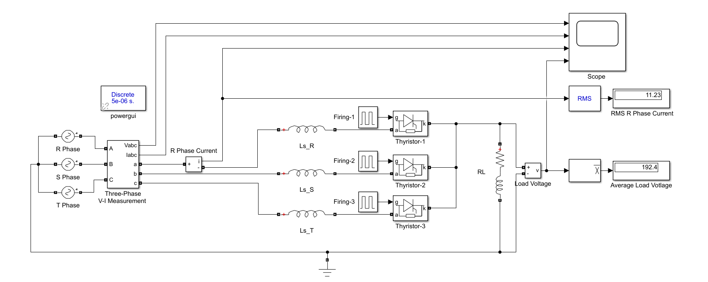
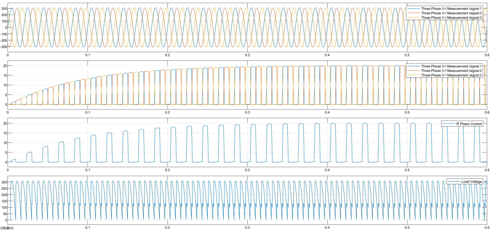

# Three-Phase Half-Wave Rectifier with Source Inductance

This project presents the simulation and mathematical analysis of a **Three-Phase Half-Wave Controlled Rectifier** considering the effect of **Source Inductance ($L_s$)**. The system feeds a large RL load.

## 🎓 Project Information
* **Course:** EEM312 Power Electronics
* **Institution:** Sakarya University
* **Term:** Spring 2016
* **Instructor:** Prof. Dr. U. Arifoğlu
* **Topic:** Term Project 5 - 3-Phase Rectifier with Commutation ($L_s$)

## 📄 Problem Statement
The rectifier is connected to a 3-phase grid through source inductances. The presence of $L_s$ causes **commutation overlap**, resulting in a voltage drop at the output.

**System Parameters:**
* **Grid Voltage:** $V_{rms} = 380 \text{ V}$ (Line-to-Line), $f = 50 \text{ Hz}$
* **Source Inductance:** $L_s = 10 \text{ mH}$ (per phase)
* **Load:** $R = 9.645 \, \Omega$, $L = 1 \text{ H}$ (High inductance ensures constant current)
* **Load Current:** $\approx 20 \text{ A}$ (Target Value)
* **Firing Angle:** $\alpha = 30^\circ$

**Objectives:**
1.  Observe the effect of source inductance on the load voltage (Commutation Notches).
2.  Calculate and simulate the Average Load Voltage ($V_{dc}$).
3.  Calculate and simulate the RMS Source Current.

## ⚙️ Simulation Settings (Simulink)
The Simulink model is configured with the following parameters:
* **Solver:** `ode23t (mod. stiff/Trapezoidal)`
* **Stop Time:** `0.6` s
* **Powergui:** Discrete, $T_s = 5e-6$ s

## 🔌 Simulink Model
The following circuit topology was implemented, including the $L_s$ inductors before the thyristors.



## 🧮 Mathematical Background
Due to the source inductance $L_s$, the current cannot change instantly from one phase to another. This overlap period is called the **Commutation Angle ($\mu$)**.

**1. Average Load Voltage ($V_{dc}$):**
The output voltage is reduced by the voltage drop across $L_s$ during commutation.

$$V_{dc} = V_{dc(\text{no-loss})} - \Delta V_x$$


$$V_{dc} = \frac{3\sqrt{2} V_{phase}}{\pi} \cos(\alpha) - \frac{3 \omega L_s I_d}{2\pi}$$

Where $I_d$ is the constant load current ($20 \text{ A}$).

**2. Commutation Overlap:**
During the interval $\mu$, two phases conduct simultaneously, and the output voltage follows the average of these two phase voltages, creating "notches" in the waveform.

## 💻 MATLAB Code

```matlab
% =========================================================================
% PROJECT 05: 3-Phase Half-Wave Rectifier with Source Inductance
% Analytical Solution using MATLAB Symbolic Toolbox
% =========================================================================

clear; clc;

% --- 1. SYSTEM PARAMETERS ---
f = 50;
w = 2 * pi * f;          % Angular frequency (rad/s)
Ls = 0.01;               % Source Inductance (10 mH)
I_load = 20;             % Target Load Current (Assumed Constant 20A)
V_LL_rms = 380;          % Line-to-Line RMS Voltage
Vm_phase = (V_LL_rms / sqrt(3)) * sqrt(2); % Peak Phase Voltage (Vm)
alpha_rad = pi/6;        % Firing Angle (30 degrees)

fprintf('--- PROJECT 05 CALCULATION RESULTS ---\n');
fprintf('Source Inductance (Ls): %.3f H\n', Ls);
fprintf('Load Current (Id):      %.1f A\n', I_load);

% --- 2. COMMUTATION ANGLE CALCULATION (Mu) ---
% The presence of Ls causes current overlap (commutation).
% Formula: cos(alpha + mu) = cos(alpha) - (2*w*Ls*Id) / (sqrt(3)*Vm)

val_cos_alpha_mu = cos(alpha_rad) - ((2 * w * Ls) / (sqrt(3) * Vm_phase)) * I_load;
alpha_plus_mu = acos(val_cos_alpha_mu); % This is (alpha + mu)
mu_rad = alpha_plus_mu - alpha_rad;     % Commutation Angle (radians)
mu_deg = rad2deg(mu_rad);               % Commutation Angle (degrees)

fprintf('Commutation Angle (mu): %.2f degrees\n', mu_deg);

% --- 3. AVERAGE LOAD VOLTAGE (Vdc) ---
% Formula with commutation drop:
% Vdc = (3*sqrt(3)*Vm / 4*pi) * (cos(alpha) + cos(alpha+mu))

V_load_avg = ((3 * sqrt(3) * Vm_phase) / (4 * pi)) * (cos(alpha_rad) + val_cos_alpha_mu);
fprintf('1. Average Load Voltage:    %.2f V\n', V_load_avg);

% --- 4. RMS SOURCE CURRENT (Is_rms) ---
% The source current has a rising edge (during mu), a flat top, and a falling edge.
% We calculate the energy in one period (2*pi) and take the root.

syms theta; % Symbolic angle variable

% Current equation during commutation (Rising Edge)
% i_comm(theta) = (sqrt(3)*Vm / 2*w*Ls) * (cos(alpha) - cos(theta))
% This is valid for theta from 'alpha' to 'alpha + mu'
i_rising = ((sqrt(3) * Vm_phase) / (2 * w * Ls)) * (cos(alpha_rad) - cos(theta));

% A) Energy during rising edge (Commutation 1)
% Integrate i^2 from alpha to alpha+mu
E_rise = int(i_rising^2, theta, alpha_rad, alpha_plus_mu);

% B) Energy during flat top (Conduction)
% Conduction lasts for (2*pi/3 - mu) radians in half-wave 3-phase.
% Constant current = I_load
theta_flat = (2*pi/3) - mu_rad;
E_flat = (I_load^2) * theta_flat;

% C) Energy during falling edge (Commutation 2)
% Due to symmetry in squared integration for linear approximations, 
% we can approximate the falling edge energy as equal to the rising edge energy 
% for the RMS calculation in this topology.
E_fall = E_rise; 

% Total RMS Calculation
% Factor 1/(2*pi) for averaging over full period
val_integral_total = double(E_rise + E_flat + E_fall);
I_source_rms = sqrt((1 / (2 * pi)) * val_integral_total);

fprintf('2. RMS Source Current:      %.2f A\n', I_source_rms);

```

## 📊 Simulation Results

The simulation clearly shows the effect of source inductance.

**1. Quantitative Measurements:**
* **Average Load Voltage:** 192.4 V
* **RMS Source Current:** 11.23 A

**2. Waveform Analysis:**
The scope output below demonstrates the **Commutation Notches** on the load voltage (bottom graph). Unlike ideal rectifiers, the voltage does not jump instantly; it transitions during the overlap period.
* **Row 1:** 3-Phase Source Voltages.
* **Row 2:** Load Current (Settles to approx 20A).
* **Row 3:** Source Current (Phase R).
* **Row 4:** Load Voltage (Note the momentary voltage drops/notches at firing points).



## 📂 Files
* [Matlab_Calculation.m](Matlab_Calculation.m)
* [Simulink_Simulation.mdl](Simulink_Simulation.mdl)