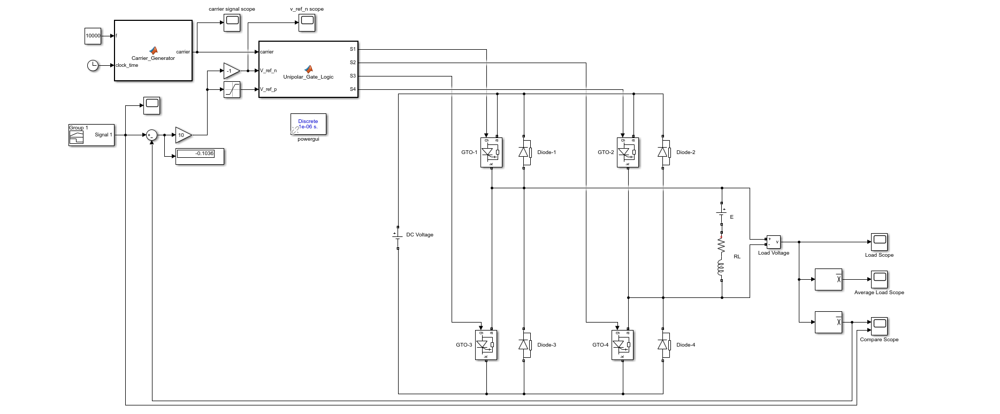
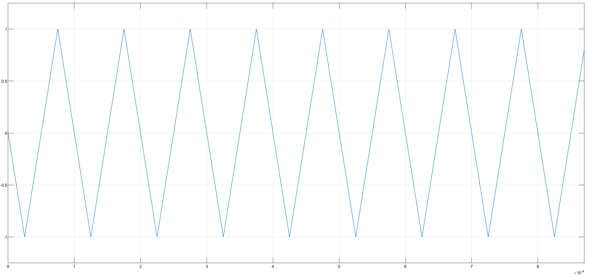
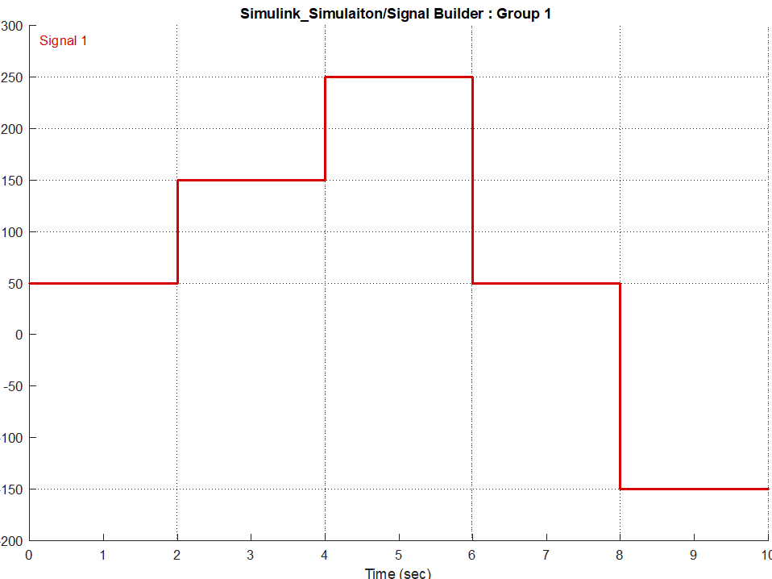
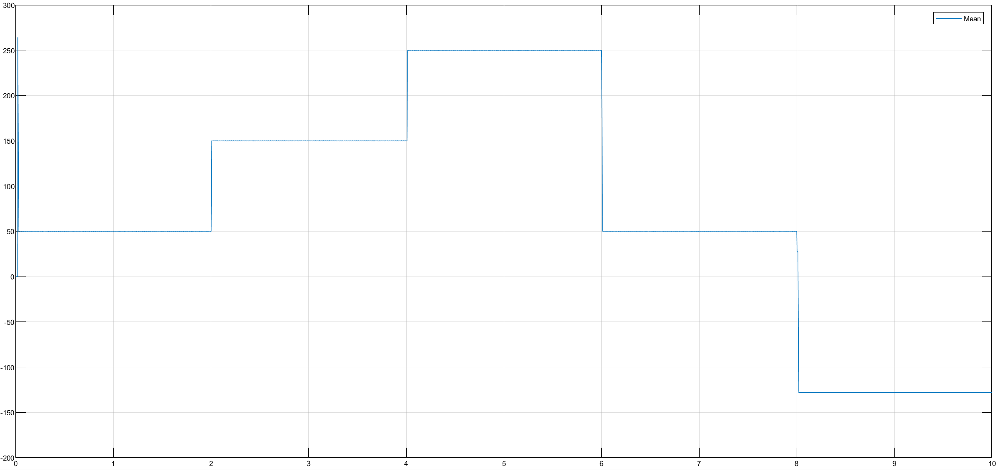
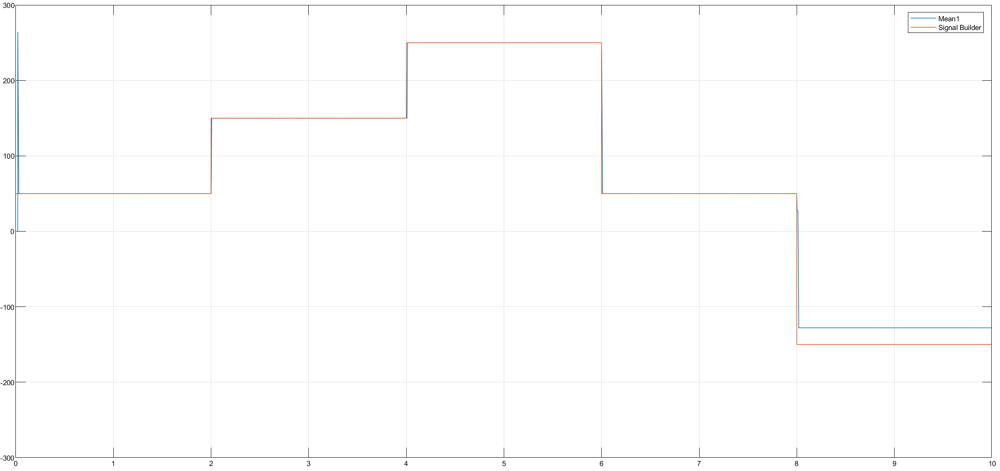

# Single-Phase Unipolar Inverter (H-Bridge DC-AC Converter)

This project simulates a **Single-Phase H-Bridge Inverter** controlled by a **Unipolar Switching Strategy**. The system is powered by a 250V DC source and feeds a complex **R-L-E load** (Resistance, Inductance, and Back-EMF).

## 🎓 Project Information
* **Course:** EEM441 Industrial Applications of Power Electronics
* **Institution:** Sakarya University
* **Term:** Spring 2016
* **Instructor:** Prof. Dr. U. Arifoğlu
* **Topic:** Project 1.3 - Unipolar Inverter with R-L-E Load

## 📄 Problem Statement
The converter is supplied by a 250V DC accumulator. It is required to drive an R-L-E load with a specific voltage profile that includes both positive and negative values.

**System Parameters:**
* **DC Link Voltage ($V_{dc}$):** $250 \text{ V}$
* **Load Resistance ($R$):** $1 \, \Omega$
* **Load Inductance ($L$):** $1 \text{ mH}$
* **Load Back EMF ($E$):** $50 \text{ V}$
* **Switching Frequency ($f_{sw}$):** $10 \text{ kHz}$
* **Switching Element:** GTO Thyristors (H-Bridge Configuration)

## 🧮 Mathematical Background

**1. H-Bridge Topology:**
The H-Bridge consists of two legs with two switches each ($S_1, S_4$ and $S_2, S_3$). The load is connected between the midpoints of the two legs.

**2. Unipolar Modulation Principle:**
Unlike Bipolar switching (where the output swings between $+V_{dc}$ and $-V_{dc}$), Unipolar switching allows the output voltage to switch between $+V_{dc}$ and $0$ (during positive half-cycles) or $-V_{dc}$ and $0$ (during negative half-cycles).

This is achieved by controlling the two legs independently:
* **Leg A ($S_1, S_2$):** Controlled by comparing the Control Signal ($V_{control}$) with the Carrier.
* **Leg B ($S_3, S_4$):** Controlled by comparing the **inverted** Control Signal ($-V_{control}$) with the Carrier.

The resulting instantaneous output voltage frequency seen by the load is effectively **double** the switching frequency ($2f_{sw}$), which significantly reduces the harmonic content and filter size requirements.

## 🔌 Circuit Diagram
The Simulink model below implements the Unipolar control. It features two Embedded MATLAB blocks: one for generating the carrier wave and another for the specific gate logic required for the H-Bridge switches.



## 💻 Embedded MATLAB Code blocks

### 1. Carrier Generator
This block generates the high-frequency triangular wave used for Pulse Width Modulation (PWM).

```matlab
function carrier = Carrier_Generator(f, clock_time)
    %#codegen
    % Generates a triangular carrier wave for PWM
    % f: Frequency (Hz)
    % clock_time: Simulation time
    
    amplitude = 1;
    carrier = 0;
    multiplier = 1;
    
    half_period = 1/(2*f);              % p (Half period duration)
    peak_time = half_period/2;          % tepe_zaman (Time to reach peak)
    
    cycle_time = mod(clock_time, 2*half_period); % t (Current time in full cycle)
    local_time = mod(clock_time, half_period);   % zaman (Current time in half cycle)
    
    % Determine the polarity multiplier based on the cycle half
    if (cycle_time < half_period)
        multiplier = -1;
    else
        multiplier = 1;
    end
    
    % Generate the Triangle Shape
    if (local_time >= peak_time)
        % Falling edge calculation
        carrier = multiplier * ((amplitude/peak_time) * (half_period - local_time));
    else
        % Rising edge calculation
        carrier = multiplier * ((amplitude/peak_time) * local_time);
    end
    
    return
end

```

This block implements the specific Unipolar PWM logic for the H-Bridge. By comparing the triangular carrier wave with separate positive and negative reference signals, it independently controls the two inverter legs to generate the required gate pulses ($S_1, S_2, S_3, S_4$). This allows the converter to produce three distinct voltage levels ($+V_{dc}, 0, -V_{dc}$), effectively doubling the switching frequency seen by the load.

```matlab
function [S1, S2, S3, S4] = Unipolar_Gate_Logic(carrier, V_ref_n, V_ref_p)
    % Unipolar PWM Switching Logic Generation
    % carrier: Triangular carrier wave
    % V_ref_n: Negative reference control signal
    % V_ref_p: Positive reference control signal
    
    S1 = 0;
    S2 = 0;
    S3 = 0;
    S4 = 0;
    
    % Leg 1 Control (Controlled by V_ref_p)
    if (V_ref_p >= carrier)
        S1 = 1;  % Switch 1 ON
    end
    if (V_ref_p < carrier)
        S3 = 1;  % Switch 3 ON (Complementary to S1)
    end
    
    % Leg 2 Control (Controlled by V_ref_n)
    if (V_ref_n >= carrier)
        S4 = 1;  % Switch 4 ON
    end  
    if (V_ref_n < carrier)
        S2 = 1;  % Switch 2 ON (Complementary to S4)
    end
    
    return
end

```

### 💡 Technical Analysis
This function receives the triangular carrier and the voltage references. It implements the logic described in the mathematical background:
* It compares $V_{ref\_p}$ (Positive Ref) against the carrier to drive **Leg 1**.
* It compares $V_{ref\_n}$ (Negative Ref) against the carrier to drive **Leg 2**.
This independent control allows the bridge to generate three voltage levels ($+V_{dc}, 0, -V_{dc}$), characterizing the Unipolar operation.



## 📊 Simulation Results

**1. Reference Voltage Profile:**
The target output voltage profile defined by the Signal Builder includes steps requiring both buck operation and polarity reversal:
* **0-2s:** 50V
* **2-4s:** 150V
* **4-6s:** 250V
* **6-8s:** 50V
* **8-10s:** -150V (Negative Voltage Generation)



**2. Measured Load Voltage (Mean):**
The plot below shows the average voltage across the R-L-E load. The system successfully tracks the reference steps.
* Note clearly that between **t=8s and t=10s**, the output voltage becomes **negative (-150V)**. This confirms the H-Bridge is successfully reversing the current flow through the load.



**3. Tracking Performance:**
Superimposing the Reference Signal (Red) and the Measured Load Voltage (Blue) demonstrates the effectiveness of the Unipolar control strategy. The system handles the transition from positive to negative voltage seamlessly.



## 📂 Files
* [Matlab_Function_Block.m](Matlab_Function_Block.m)
* [Simulink_Simulation.mdl](Simulink_Simulation.mdl)