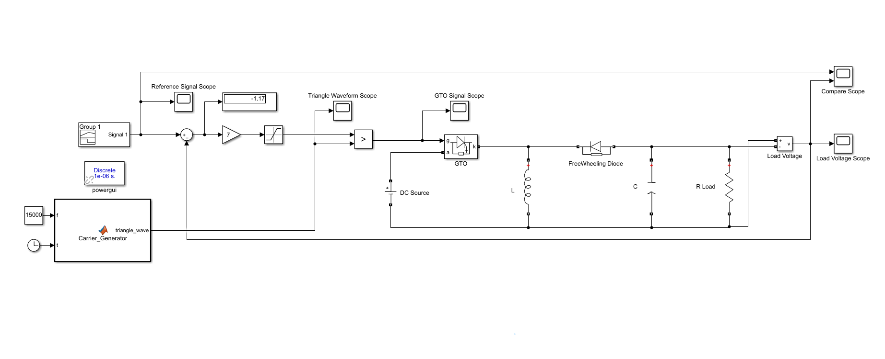
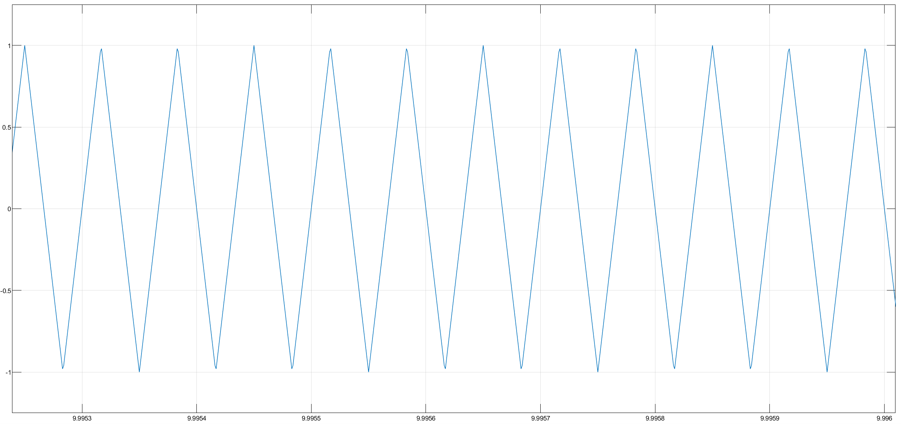
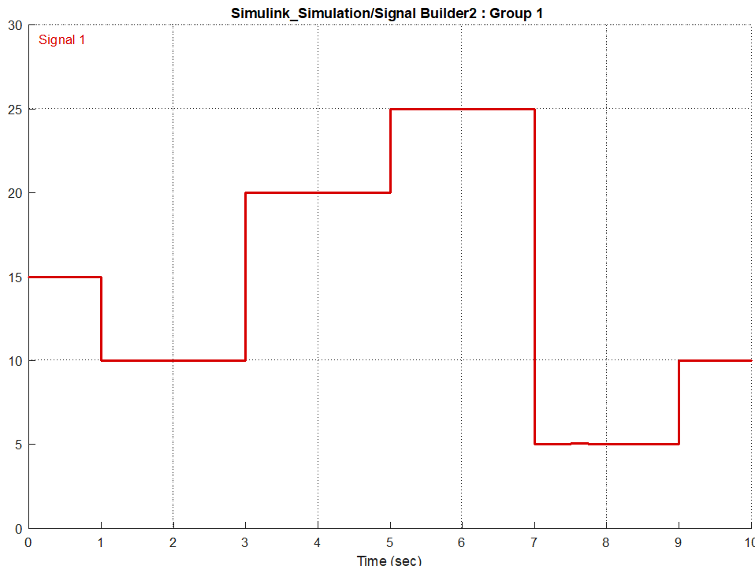
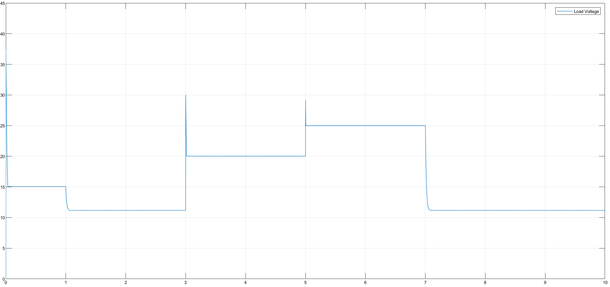
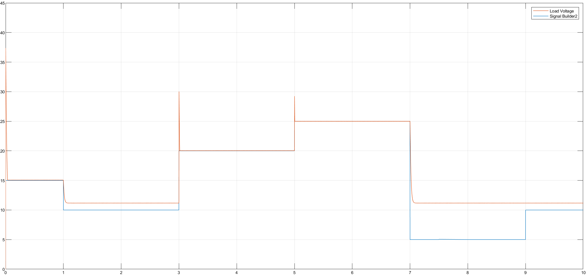

> 🇹🇷 **[Türkçe Versiyon İçin Tıklayınız / Click for Turkish Version](README_TR.md)**

---

# DC-DC Buck-Boost Converter (Step-Up/Step-Down)

This project simulates a **DC-DC Buck-Boost Converter** capable of regulating an output voltage that can be either lower or higher than the input source voltage ($E=15V$). The system uses a feedback control loop with a custom PWM generator to track a dynamic reference profile.

## 🎓 Project Information

| Field | Details |
| :--- | :--- |
| Course | EEM441 Industrial Applications of Power Electronics |
| Institution | Sakarya University |
| Term | Spring 2016 |
| Instructor | Prof. Dr. U. Arifoğlu |

## 📄 Problem Statement

The converter is powered by a 15V DC source and supplies a resistive load ($R=100\Omega$). It must accurately track a reference voltage that steps between levels requiring both Buck (step-down) and Boost (step-up) modes of operation.

### System Parameters

* **Input Voltage ($V_{in}$):** $15 \text{ V}$
* **Load Resistance ($R$):** $100 \, \Omega$
* **Switching Frequency ($f_{sw}$):** $15 \text{ kHz}$
* **Filter:** $L = 300 \ \mu H$, $C = 250 \ \mu F$
* **Switching Element:** GTO Thyristor

### Objective

1.  **Converter Design:** Design and simulate a **DC-DC Buck-Boost Converter** (Step-Down/Step-Up Chopper) using a **GTO (Gate Turn-Off Thyristor)** as the switching element.
2.  **Voltage Regulation:** Control the output voltage across a resistive load ($R=100\Omega$) fed from a fixed $15\text{V}$ DC source.
3.  **Dynamic Tracking:** Implement a control mechanism where the load voltage follows a specific time-varying profile defined by a **Signal Builder** block.
4.  **Performance Analysis:** Analyze the voltage and current waveforms under a switching frequency of **15 kHz**.

### Simulation Parameters

The simulation is configured with the following specific values and solver settings:

| Fiels | Details |
| :--- | :---: |
| **Simulation Mode** | Discrete |
| **Sample Time** |  $T_s$ User Defined s |

## 🧮 Mathematical Background

The Buck-Boost converter is an inverting topology where the output voltage polarity is opposite to the input. However, considering the magnitude, it can step voltage up or down based on the Duty Cycle ($D$).

**Transfer Function:**
The ideal relationship between input and output voltage in Continuous Conduction Mode (CCM) is:

$$|V_{out}| = V_{in} \frac{D}{1-D}$$

**Operating Modes:**
1.  **Buck Mode ($D < 0.5$):** The output voltage is lower than the input.
    * *Example:* To get 5V output from 15V input:
        
$$5 = 15 \frac{D}{1-D} \implies 20D = 5 \implies D = 0.25$$
		
2.  **Boost Mode ($D > 0.5$):** The output voltage is higher than the input.
    * *Example:* To get 25V output from 15V input:

$$25 = 15 \frac{D}{1-D} \implies 40D = 25 \implies D = 0.625$$

3.  **Unity Gain ($D = 0.5$):** The output voltage equals the input voltage (15V).

## ⚙️ System Topology & Simulation Model

### Circuit Diagram & Simulink Model

The Simulink model below implements the closed-loop control. It compares the measured load voltage with the reference signal, calculates the error, and adjusts the PWM duty cycle using a custom triangular carrier wave.



### Simulation Parameters


## 💻 Control Algorithm & Implementation

The following section is reserved for the Embedded MATLAB script used to generate the triangular carrier wave for PWM modulation at 15 kHz.

### Embedded MATLAB Code (Carrier Generator)

```matlab
function triangle_wave = Carrier_Generator(f, t)
%#codegen
% Generates a triangular carrier wave for Buck-Boost Converter PWM
% f: Frequency (Hz), t: Simulation time (clock)

amplitude = 1;
triangle_wave = 0;
multiplier = 1;

half_period = 1/(2*f);             % p
peak_time = half_period/2;         % tepe_zaman

cycle_time = mod(t, 2*half_period);   % t (Current position in full cycle)
local_time = mod(t, half_period);     % zaman (Current position in half cycle)

% Determine polarity based on cycle position
if (cycle_time < half_period)
    multiplier = -1;
else
    multiplier = 1;
end

% Generate Triangle Shape
if (local_time >= peak_time)
    % Falling edge calculation
    triangle_wave = multiplier * ((amplitude/peak_time) * (half_period - local_time));
else
    % Rising edge calculation
    triangle_wave = multiplier * ((amplitude/peak_time) * local_time);
end

return

```

### Code Logic & Explanation

The code mathematically generates a triangular waveform based on the simulation clock `t` and the specified frequency `f` (15 kHz).
* It calculates the period ($T = 1/f$) and creates a rising and falling slope using linear equations ($y = mx+c$).
* This **"Carrier Wave"** is essential for the PWM comparator.
* By comparing the **Control Signal** (derived from the voltage error) with this Carrier Wave, the system generates the precise switching pulses (Duty Cycle) needed to turn the GTO on and off.



## 📊 Results & Discussion

**1. Reference Voltage Profile:**
The target output voltage profile is defined by the Signal Builder. The system must track these distinct steps:
* **0-1s:** 15V ($D=0.5$)
* **1-3s:** 10V (Buck Mode)
* **3-5s:** 20V (Boost Mode)
* **5-7s:** 25V (Boost Mode)
* **7-9s:** 5V (Buck Mode)
* **9-10s:** 10V (Buck Mode)



**2. Measured Load Voltage:**
The graph below shows the actual voltage across the load ($R=100\Omega$). The system successfully steps the voltage up and down, matching the reference profile.



**3. Tracking Performance:**
Superimposing the Reference Signal (Blue) and the Measured Load Voltage (Red) shows the effectiveness of the control loop. The converter rapidly adjusts to new voltage levels with minimal steady-state error.



## 📂 Project Files

* [Matlab_Carrier_Generator.m](Matlab_Carrier_Generator.m) - MATLAB script for initializing variables (if used).
* [Simulink_Simulation.slx](Simulink_Simulation.slx) - The main Simulink model file.