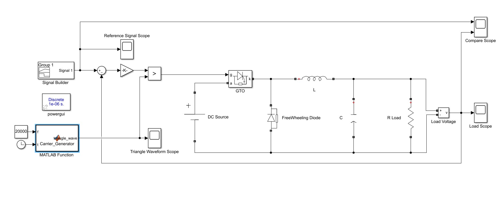
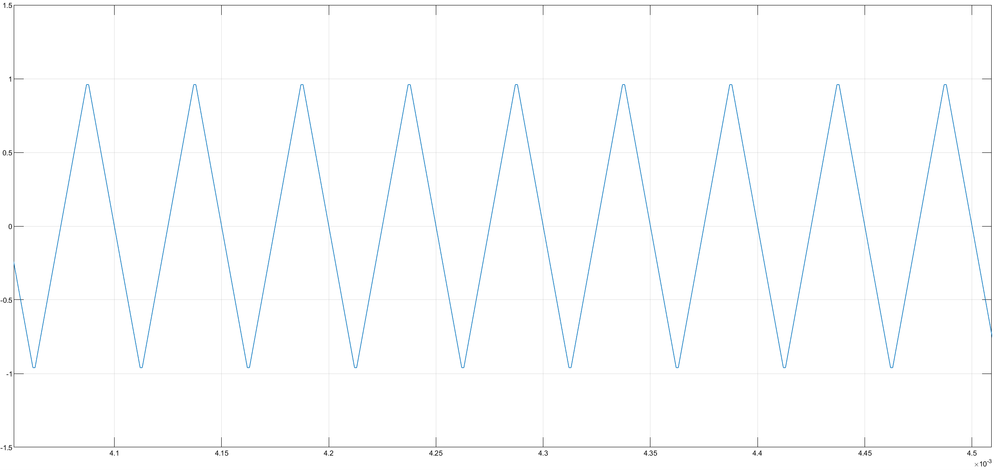
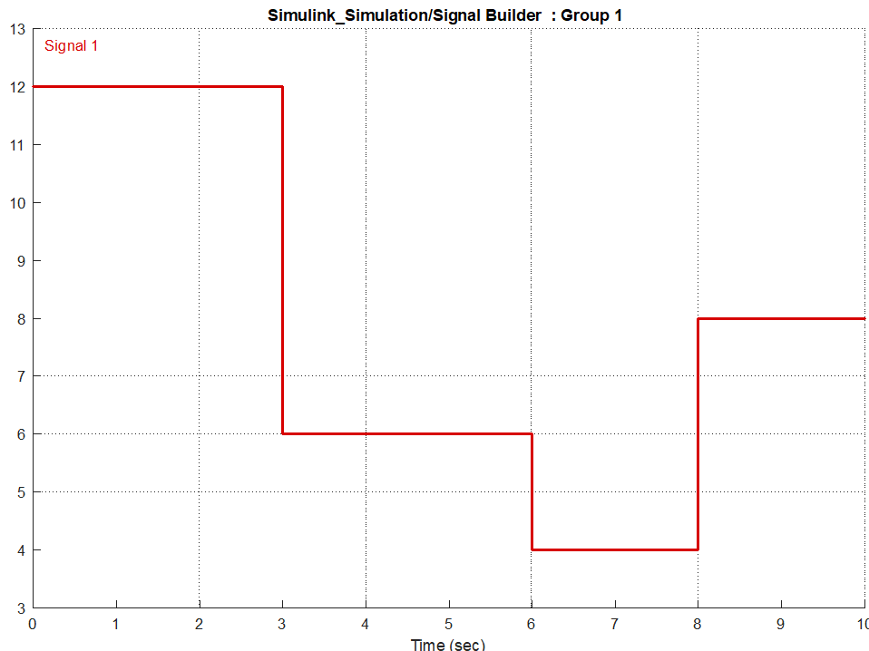
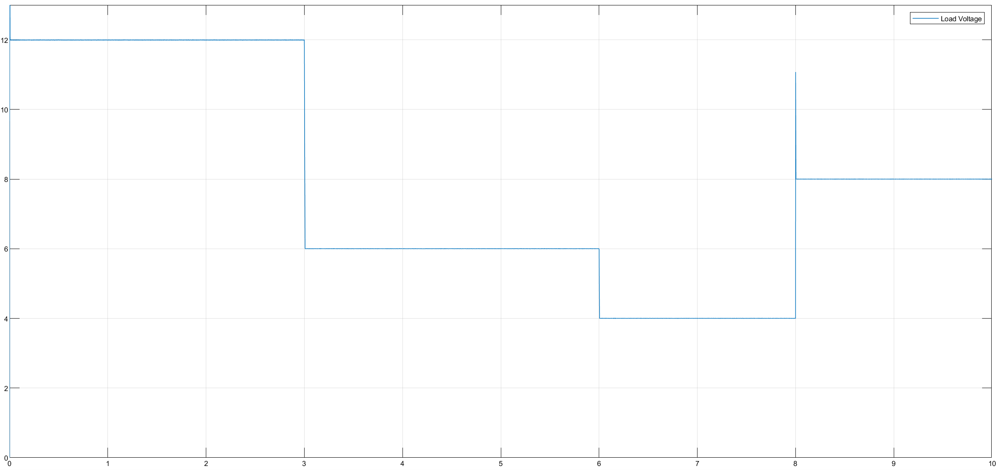
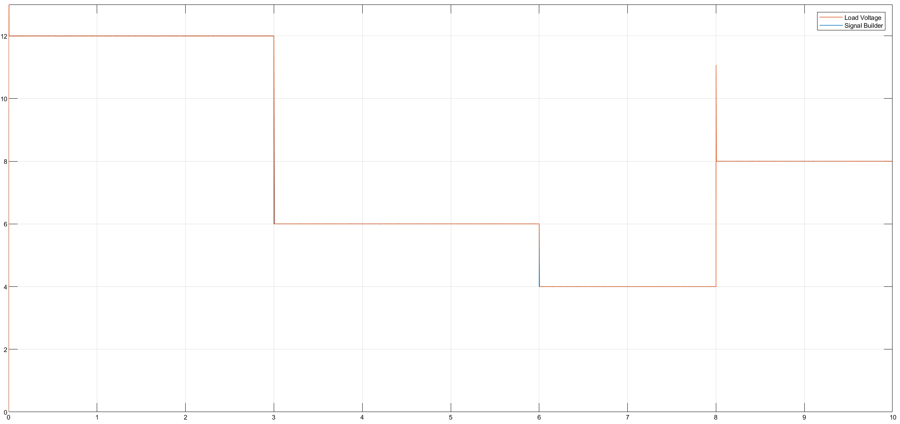

> 🇹🇷 **[Türkçe Versiyon İçin Tıklayınız / Click for Turkish Version](README_TR.md)**

---

# DC-DC Buck Converter (Step-Down)

This project simulates a **DC-DC Buck Converter** fed by a constant DC source ($E=15V$). The system uses an open-loop control strategy with a custom carrier wave generator to regulate the output voltage across a resistive load.

## 🎓 Project Information

| Field | Details |
| :--- | :--- |
| Course | EEM441 Industrial Applications of Power Electronics |
| Institution | Sakarya University |
| Term | Spring 2016 |
| Instructor | Prof. Dr. U. Arifoğlu |

## 📄 Problem Statement

A Buck converter is supplied by a 15V DC source. It feeds a resistive load ($R=25\Omega$) through an LC filter ($L=0.1$ mH, $C=470$ $\mu$F). The switching element is a Gate Turn-Off Thyristor (GTO) operating at 20 kHz.

### System Parameters

* **Input Voltage ($V_{in}$):** $15 \text{ V}$
* **Load Resistance ($R$):** $25 \, \Omega$
* **Switching Frequency ($f_{sw}$):** $20 \text{ kHz}$
* **Filter:** $L=0.1$ mH, $C = 470 \ \mu F$

### Objective

1.  **Converter Design:** Design and simulate a **DC-DC Buck Converter (Step-Down Chopper)** using a **GTO (Gate Turn-Off Thyristor)** as the switching element.
2.  **Voltage Regulation:** Control the output voltage across a resistive load ($R=25\Omega$) fed from a fixed $15\text{V}$ DC source.
3.  **Dynamic Tracking:** Implement a control mechanism where the load voltage follows a specific time-varying profile defined by a **Signal Builder** block.
4.  **Performance Analysis:** Analyze the voltage and current waveforms under a high switching frequency of **20 kHz**.

## 🧮 Mathematical Background

A Buck converter is a step-down DC-DC converter. The average output voltage ($V_{out}$) is controlled by adjusting the switch's Duty Cycle ($D$), which is the ratio of the ON time ($T_{on}$) to the total switching period ($T$).

The fundamental relationship for an ideal Buck converter in Continuous Conduction Mode (CCM) is:

$$V_{out} = V_{in} \cdot D$$

$$D = \frac{V_{out}}{V_{in}}$$

Since the input voltage ($V_{in}$) is fixed at 15V, the control logic must calculate the required $D$ for each target output voltage level.

* For $V_{out} = 12V \implies D = 0.80$
* For $V_{out} = 6V \implies D = 0.40$
* For $V_{out} = 4V \implies D = 0.26$
* For $V_{out} = 8V \implies D = 0.53$

## ⚙️ System Topology & Simulation Model

### Circuit Diagram & Simulink Model

The circuit consists of the DC source, GTO switch, Free-wheeling Diode, LC filter, and the load.



### Simulation Parameters

The simulation is configured with the following specific values and solver settings:

| Fiels | Details |
| :--- | :---: |
| **Simulation Mode** | Discrete |
| **Sample Time** |  $T_s$ User Defined s |

## 💻 Control Algorithm & Implementation

The following section is reserved for the Embedded MATLAB script used to generate the triangular carrier wave for PWM modulation at 20 kHz.

### Embedded MATLAB Code (Carrier Generator)

```matlab
function triangle_wave = Carrier_Generator(f, t)
%#codegen
% Generates a triangular carrier wave for PWM
% f: Switching Frequency (Hz)
% t: Simulation Clock Time (s)

amplitude = 1;
triangle_wave = 0;
multiplier = 1;

half_period = 1/(2*f);            % p
peak_time = half_period/2;        % tepe_zaman

cycle_time = mod(t, 2*half_period);   % t (Current position in full cycle)
local_time = mod(t, half_period);     % zaman (Current position in half cycle)

% Determine polarity based on cycle position
if (cycle_time < half_period)
    multiplier = -1;
else
    multiplier = 1;
end

% Generate Triangle Shape
if (local_time >= peak_time)
    % Falling edge calculation
    triangle_wave = multiplier * ((amplitude/peak_time) * (half_period - local_time));
else
    % Rising edge calculation
    triangle_wave = multiplier * ((amplitude/peak_time) * local_time);
end

return

```

### Code Logic & Explanation

The code generates a triangular waveform based on the system simulation time `t` and frequency `f`. This carrier wave allows for the implementation of Pulse Width Modulation (PWM) by comparing it against the calculated duty cycle reference. This comparison generates the switching pulses for the GTO.



## 📊 Results & Discussion

**1. Reference Voltage Profile:**
The target output voltage profile is defined by a Signal Builder block:
* 0-3s: **12V**
* 3-6s: **6V**
* 6-8s: **4V**
* 8-10s: **8V**



**2. Measured Load Voltage:**
The plot below shows the voltage across the load. The system tracks the stepped reference signal by dynamically adjusting the pulse width.



**3. Tracking Performance:**
The comparison between the Reference Signal (Blue) and the Load Voltage (Red) demonstrates the controller's ability to follow the desired profile.



## 📂 Project Files

* [Matlab_Carrier_Generator.m](Matlab_Carrier_Generator.m) - MATLAB script for initializing variables.
* [Simulink_Simulation.slx](Simulink_Simulation.slx) - The main Simulink model file.