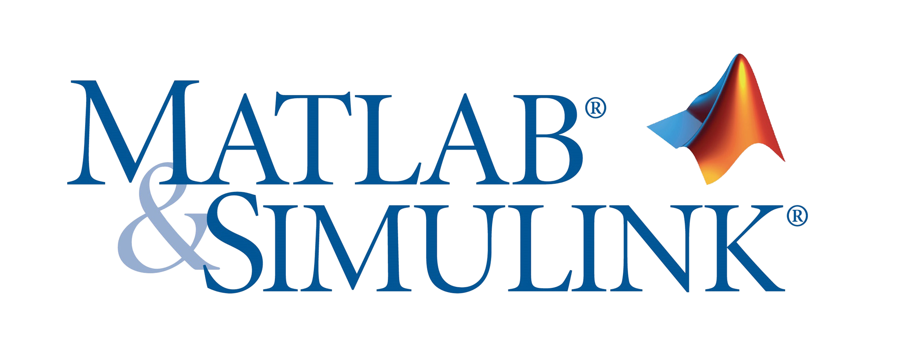

  

<h1 align="center">Matlab / Simulink Power Electronics Projects</h1>

  
  
  

---
## Introduction

Simulation projects for Power Electronics circuits using MATLAB/Simulink.

## 📂 Projects

- [AC-DC_1Ph_FullWave_Controlled_Rectifier_RLE_Load](./AC-DC_1Ph_FullWave_Controlled_Rectifier_RLE_Load)
- [AC-DC_1Ph_HalfWave_Controlled_Rectifier_with_FWD_RLE_Load](./AC-DC_1Ph_HalfWave_Controlled_Rectifier_with_FWD_RLE_Load)
- [AC-DC_1Ph_HalfWave_Controlled_Rectifier_with_FWD_RL_Load](./AC-DC_1Ph_HalfWave_Controlled_Rectifier_with_FWD_RL_Load)
- [AC-DC_1Ph_PWM_Rectifier_Closed_Loop_IGBT](./AC-DC_1Ph_PWM_Rectifier_Closed_Loop_IGBT)
- [AC-DC_1Ph_Rectifier_Closed_Loop_Thyristor](./AC-DC_1Ph_Rectifier_Closed_Loop_Thyristor)
- [AC-DC_3Ph_FullWave_Controlled_Rectifier_Resistive_Load](./AC-DC_3Ph_FullWave_Controlled_Rectifier_Resistive_Load)
- [AC-DC_3Ph_FullWave_Rectifier_with_Source_Inductance](./AC-DC_3Ph_FullWave_Rectifier_with_Source_Inductance)
- [AC-DC_3Ph_HalfWave_Controlled_Rectifier_Resistive_Load](./AC-DC_3Ph_HalfWave_Controlled_Rectifier_Resistive_Load)
- [AC-DC_3Ph_HalfWave_Rectifier_with_Source_Inductance](./AC-DC_3Ph_HalfWave_Rectifier_with_Source_Inductance)
- [DC-AC_1Ph_Inverter_Unipolar](./DC-AC_1Ph_Inverter_Unipolar)
- [DC-DC_Buck_Boost_Converter_Open_Loop](./DC-DC_Buck_Boost_Converter_Open_Loop)
- [DC-DC_Buck_Converter_Open_Loop](./DC-DC_Buck_Converter_Open_Loop)

## Licenses

 
All **Images, Schematics & Presentations** inside this portfolio are licensed under a <a rel="license" href="http://creativecommons.org/licenses/by-sa/4.0/">Creative Commons Attribution-ShareAlike 4.0 International License</a>.

  

**Source Code (MATLAB/Simulink Files)** are licensed under the **Apache License 2.0**.

## Credits
All credits, references, and used standard components are listed within the project descriptions respectively.